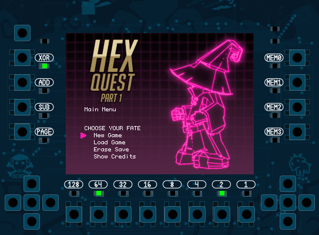
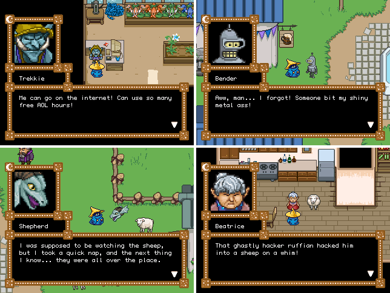

# DC801 Black Mage Badge
The DC801 Badge Platform for DC28+

## Hardware
The DC801 BM-Badge brings you an expandable iteration of our robust platfom.

 - Core CPU is the Nordic nRF52840 SoC, on the u-blox BMD-340 module
   - [https://www.u-blox.com/en/product/bmd-34-series-open-cpu](https://www.u-blox.com/en/product/bmd-34-series-open-cpu)
   - 256k RAM, 1M internal flash, ARM® Cortex™ M4F CP @ 64Mhz
   - Bluetooth 5 with Bluetooth mesh and Zigbee support
   - Temperature sensor
 - 27 buttons with NKRO via a dedicated controller
   - Microchip ATiny1617 microcontroller, with UPDI programming support
   - [https://www.microchip.com/wwwproducts/en/ATtiny1617](https://www.microchip.com/wwwproducts/en/ATtiny1617)
 - 19 LEDs
 - SD card socket
 - 32MB of quad-spi flash
 - NAU8810 audio codec and speaker
 - 2.4" 240x320 TFT LCD screen with touch panel
 - LiPo battery with on-board charging
 - USB-C interface supporting USB endpoints
 - SAO 1.69bis and Saintcon MiniBadge expansion headers
 - Support for the DC801 ART front board expansion
 - JTAG via both standard ARM interface as well as Tag Connect
 - USB drag-and-drop programming via a UF2 interface (based on the [adafruit bootloader](https://github.com/adafruit/Adafruit_nRF52_Bootloader))
 - Exciting new artwork and sandwich design

Board design is in KiCad

See the [HW](/HW) directory for more info, schematics and etc

### ART - Asymmetric Resistive Token
Since this badge is a sandwich platform badge, we've include a template so that you can design your own front boards.

Check out the [Template](/HW/ART/Template) that you can create a new project in KiCad with.

## Software
 - Environment is GNU ARM GCC with your choice of IDE (We're currently using CLion and VSCode)
 - Need a J-Link Segger JTAG programmer to program the chip directly.
 - Custom game engine purpose-built for the badge that can automatically load custom games from the SD Card.
 - Included in the [SD_Card/MAGE](/SD_Card/MAGE) directory is a binary encoder that allows you to generate your own games with our engine using open source tools such as the Tiled Map Editor and our custom json scripting language.
 - Instructions to set up your own dev environment and desktop testing build of our game engine in [EnvironmentSetup.md](/EnvironmentSetup.md).
 - [Comprehensive engine documentation and content creation guide](SD_Card/MAGE/README.md)

### SD Card
Format your SD card as FAT32 and copy the contents of [SD_Card](SD_Card) into it.
This year's badge game engine allows for you to run custom games from binary files on the SD card.

## Gameplay Videos

[DC28 DC801 SAFEMODE badge, 2020-12-04 development update](https://vimeo.com/487527877): Watch almost 6 minutes of 100% in-engine gameplay in our 2020-12-04 development update video!

[DC28 DC801 SAFEMODE badge, 2021-02-21 development update](https://vimeo.com/515088170):
Watch one of our puzzles and see some of our new narrative focused engine scripting capabilities in our 2021-02-21 development update video!

## DC28 dev team

Project owner
- [@nemus](https://twitter.com/Nemus801)

Software Team
- [@_bashNinja](https://twitter.com/_bashNinja)
- [@admiral_potato](https://twitter.com/admiral_potato)
- [@corfidbizna](https://twitter.com/corfidbizna)
- [kiyoshigawa](https://twa.ninja/)
- [@newzie1](https://twitter.com/newzie1)
- [@tazmodius](https://twitter.com/tazmodius)
- @alamedyang

Hardware Team
- [@dvdfreitag](https://twitter.com/dvdfreitag)
- [@hamster](https://twitter.com/hamster)

Honorable Mention
- [@pips801](https://twitter.com/pips801)