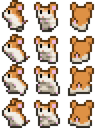
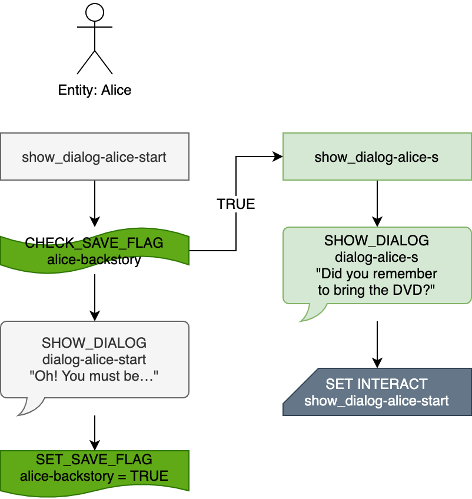
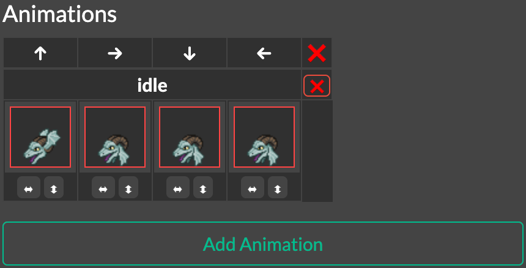
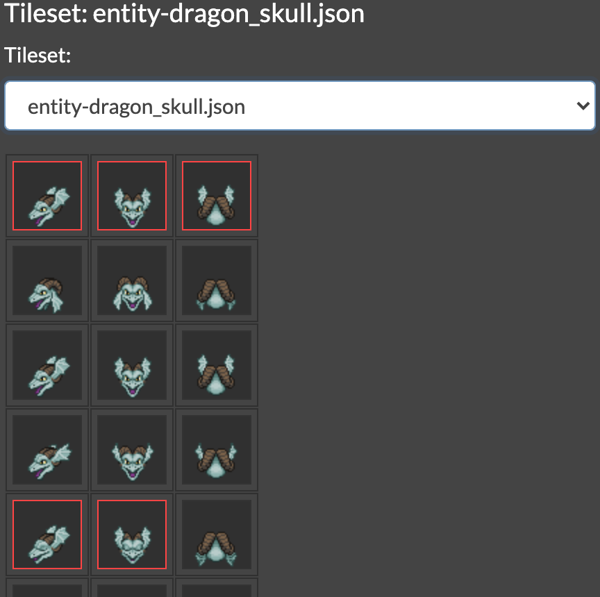
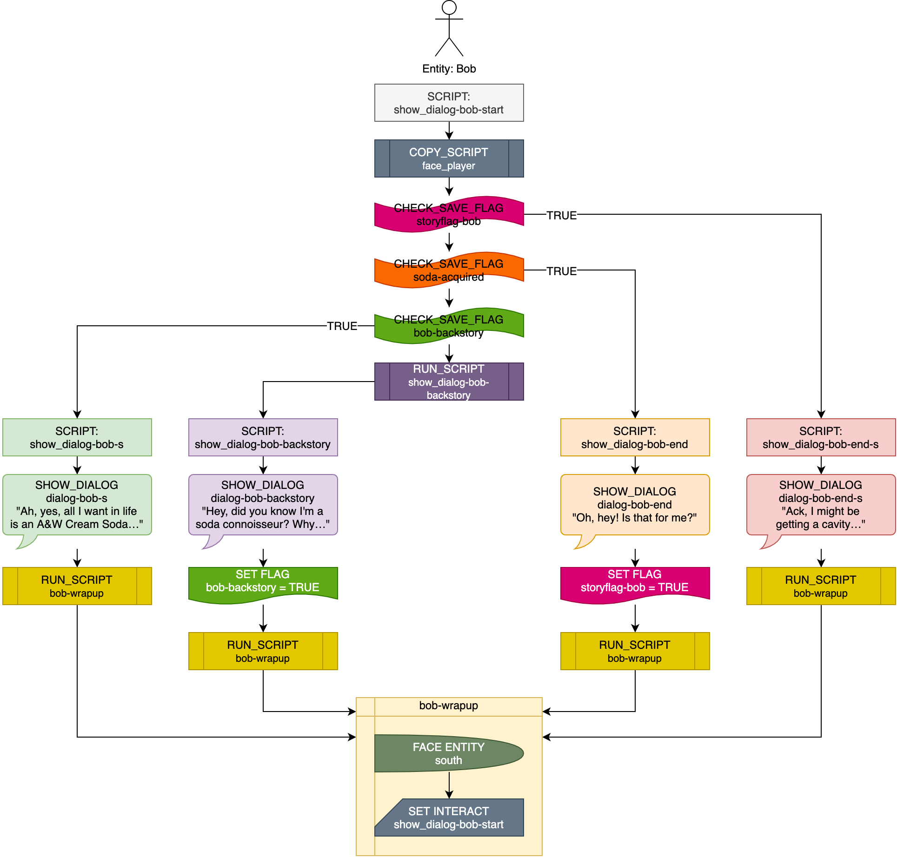
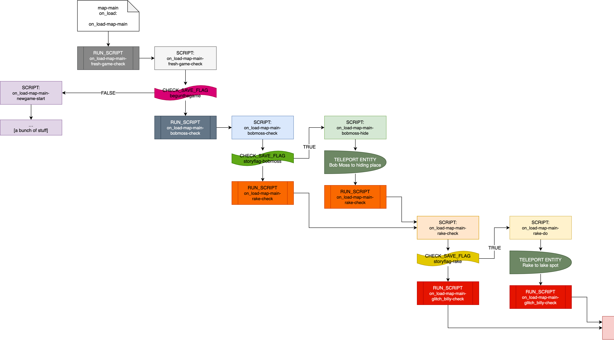
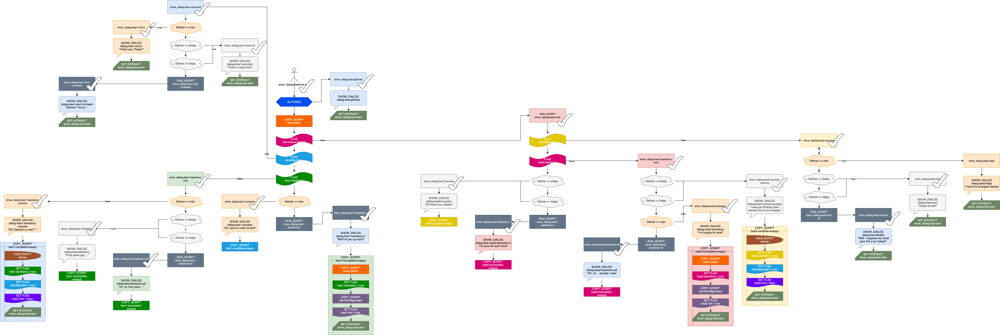

# Mage Game Engine (MGE) Content Creation Guide

An explanation of how to create content for the “Mage Game Engine” (MGE) and other information for working with the “Black Mage” game for DC801’s party badge (BMG2020).

## What You'll Need

The MGE is data driven, meaning you won’t need to write code or use a compiler to generate game content. All you will need are:

### Graphics Software

Any graphics editor capable of doing sprite art can make sprite sheets or tilesets, but if you need custom animation, we highly recommend investing in [Aseprite](https://www.aseprite.org/). It’s about $20, but it specializes in creating sprite animations, and it makes previewing animations and exporting sprite sheets quite painless.

### Text Editor

We recommend Visual Studio Code, which is free and open source, and has great syntax parsers and Git integration. Get it at https://code.visualstudio.com/ (Mac, Linux, or Windows).

### A Web Browser

The MGE encoder can use a modern web browser to take all the game files (contained in your `scenario_source_files/` folder) and export a binary data file (`game.dat`) for the engine to use.

### Node.js

If you find yourself constantly making small changes to your content and regenerating your `game.dat` very frequently, it may be worthwhile to install `node.js`, and use our command line script to regenerate the `game.dat` from the command line, instead.

### MicroSD Card

To put a new `game.dat` onto the badge, you will need a microSD card formatted to FAT32 (and a card reader for your computer).

### Git

While strictly optional, it’s always nice to version control your projects, especially if working with multiple people. We recommend Sublime Merge if you’re just getting started with Git, or the JetBrains’ Git tools if you’re already using one of their IDEs.

## `MAGE/` Folder

There’ll be a bunch of stuff in the game folders, but relevant to creating new content are:

`editor/index.html` — The MGE web encoder. To generate a `game.dat`, you can open this file in a web browser and follow the instructions. (See the **MGE Encoder** section below for more info.)

`game.dat` — This is the actual data for your game. If you generated a `game.dat` using the encoder above, you must copy that file here for the desktop build to see it.

`replace_dat_file_with_downloaded.sh` — A shell script for grabbing the latest `game.dat` from your Downloads folder and moving it to your current directory. (Don’t forget to CD into `MAGE/` first!)

`regenerate_dat_file.sh` — A shell script for rebuilding the `game.dat` and moving it into your current directory. (Don’t forget to CD into `MAGE/` first!) This script requires node.js to run.

`scenario_source_files/` — This is where your raw game data lives.

### Inside `scenario_source_files/` (Overview)

`dialog/` — This folder contains dialog JSON files. For BMG2020, all dialog files are prefixed with dialog-.

`entities/` — This folder is for all character entity information, such as entity sprite sheets, portraits, and the JSON files that drive them (as created by Tiled). This folder will likely be 50% images and 50% JSON files. For BMG2020, all entity files are prefixed with `entity-`. For entities, the file name should match the `entity_type` name.

`maps/` — All map JSON files (made with Tiled) go in here. Make sure all Tiled files are in the correct place before filling them with stuff or it’ll all break when you move them. For BMG2020, all map files are prefixed with `map-`.

`scripts/` — All script JSON files go in here. For BMG2020, all script files are prefixed with `script-`.

`tilesets/` — All tileset images and JSON files (made with Tiled) go in here. Again, make sure these Tiled JSON files are in the correct place before using them on maps or everything will break when you move them. For BMG2020, all tileset files (regardless of their purpose) are prefixed with `tileset-`.

`portraits.json` — Identifies JSON files within `entities/` and assigns them a name (which should match their associated `entity_type` name, if any), plus a few other properties that the MGE needs. If you add a new portrait JSON file to the `entities/` folder, be sure to include it in `portraits.json` or the encoder will ignore it.

`entity_types.json` — Identifies JSON files within `entities/` and assigns them various properties the MGE needs. This is where character animations are assigned to their MGE purposes (idle, walk, action, etc. — and north, south, west, east), and while this assignment can be done within the MGE encoder, the web browser cannot write to this file directly, and you will therefore need to copy the updated data for `entity_types.json` into the actual file yourself.

`scenario.json` — This file tells the MGE encoder which JSON files to include for scripts, dialogs, maps, and dialogSkins. This file must be updated manually if you create a new file of those types or the encoder will ignore it.

For BMG2020, dialog, maps, and scripts tend to be consistently named. For instance, if you added a new map to the game called “secret mines,” you might add:

- `map/map-secretmines.json`
- `scripts/script-secretmines.json`
- `dialog/dialog-secretmines.json`

However, note that splitting scripts and dialog into multiple files is a matter of convenience, not a requirement — there’s literally nothing stopping you from putting 100% of the game’s scripts inside a single script file within `scripts/`. And once in a while you might very well want to have general-use scripts in a common space, or you’ll find yourself referring to a script in another script file. But for BMG2020, we prefer each isolated block of content (usually a map) to have its own separate files, as demonstrated above.

## General Process

An example production pipeline. The general order can vary a bit, and previous steps might be revisited at any point.

1. Clone the sample game project repo. (https://github.com/AdmiralPotato/mage_game-external_scenario_source_files) 
2. Prepare entities.
	1. Acquire spritesheet(s).
	2. In Tiled, make entity tileset JSON file(s).
		- Put it in `entities/`.
		- On all tiles, set the type property to what you want the entity’s `entity_type` to be.
		- Create animations: set frames and timings for at least idle, walk, action.
	3. Prepare `entity_types.json`.
		- In the web encoder, assign animations to animation types and NSEW directions.
		- Paste updated entity data into `entity_types.json`.
	4. Prepare dialog portraits
		- In Tiled, prepare a tileset JSON file for the talk portrait(s).
			- Put it in `entities/`.
		- Prepare `portraits.json`.
		- Assign portraits to their entities in `entity_types.json` if the portrait name does not match an `entity_type`.
3. Prepare map(s).
	1. Acquire tileset graphics.
	2. In Tiled, make a tileset JSON file.
		- Put it in `tilesets/`.
		- Set collision vectors for each tile.
	3. In Tiled, make a map using the tileset(s) from above.
	4. Place entities.
		- Set entity properties, e.g.
			- Name
			- `is_player`
			- `on_tick`
			- `on_interact`
	5. Draw vector shapes, e.g.
		- Walk paths
		- Doorways
		- “Walking out the door” paths
		- Camera targets
	6. Add map file(s) to `scenario.json`.
4. Prepare dialog skin(s).
	1. In Tiled, make tileset JSON file(s).
		- Put it in `tilesets/`.
	2. Add dialogSkin file(s) to `scenario.json`.
5. Prepare dialogs in `dialogs/`.
	1. Add dialog file(s) to `scenario.json`.
6. Prepare scripts in `scripts/`.
	1. Plan logic with flowcharts (optional)
	2. Doorway watchers
	3. “Walking out the door” behavior
	4. Entity dialog
	5. Cutscenes
	6. Add script file(s) to `scenario.json`.
7. Encode the `game.dat`.
8. Test the game.
	1. See if it works on the desktop build.
		- Move `game.dat` to the right place.
		- Run the game.
	2. Verify on hardware.
		- Copy `game.dat` onto microSD card
		- Insert microSD card into hardware.
		- Flash the game.
		- Run game.

---

# Tilesets

A tileset is a series of images on a grid of uniform size used to modularly create larger images. For the MGE, they’re used to draw the dialog box frame and game maps.

## Tilesets

Map tilesets contain square blocks of terrain which can be used for building the world. There is no required structure for how the tiles should be arranged, but ordinarily, similar tiles are placed near each other. A map tileset is not expected to be animated (though you could animate any of it if you wanted).

All **tileset tiles need to be perfect squares** because tiles can be rotated or flipped on either axis when building maps.

## Sprite Sheets

Likewise, **sprite sheets** are made up of tiles of uniform size on a grid, and they contain every iteration of a sprite needed for all of its animations. Due to the way Tiled defines animations, the order of the sprite tiles doesn’t matter, but for BMG2020 we tend to have one sprite tile for the side view, front view, and back view on one row, going down the image in a series of rows.

The tiles on the sprite sheet need not be square, though it is preferred.

Sprite sheets are handled like tilesets within Tiled and the MGE encoder.

For the MGE, the **tile size should not exceed 128x128** or it may not run on the badge hardware.

## MGE Tileset Considerations

For tilesets of all types:

**Alpha (transparency) is 1-bit**; you cannot have partially transparent pixels. Semi-transparent pixels are assigned either to be fully opaque or fully transparent at a 50% threshold.

To encode alpha, the MGE repurposes the least-significant green bit in the 5-6-5 color encoding scheme. Because of how the encoder handles this, the color 0x0200 (hex #004000, or rgb 0,64,0) will actually manifest as transparent within the MGE. Avoid using this color.

The MGE encoder indexes the pallets of each image, and there is therefore a **maximum of 256 colors per tileset**. If you need extra colors, consider splitting the tileset into multiple files — maps will quite happily use tiles from multiple tilesets with no trouble (provided the tiles are the same size). The MGE encoder will let you know if one of your tilesets is over the color limit.

> **Best Practices:** On embedded, pixel data is streamed from the ROM chip, but the tileset pallets must be held in RAM. Because RAM is very, very precious, **please combine tilesets if there isn’t a compelling reason to keep them in separate files**. Entity sprite sheets are typically kept separate, for instance, but you might combine all character entity portraits if the color limit permits. (And naturally, tilesets with differing tile sizes must be separate!)

## Creating a Tileset JSON File

The MGE encoder cannot use image files outright — there must be an associated JSON file (made with Tiled) that explicitly defines the image file path and various other properties.

Within Tiled:

1. Go to “File > New Tileset…”
2. Name the file. For BMG2020, prefix the name with `tileset-` or `entity-` as appropriate.
3. For “source,” use the file explorer to choose the sprite sheet or tileset you want to use. (Please make sure the image file is in its final destination ahead of time. Moving it after assigning it can be a bit of a hassle.)
4. Set the tile width and height to the tile size of your image.
5. Save the tileset file:
	- Set the format to JSON.
	- Set the correct destination folder: `entities/` for entities, and `tilesets/` for everything else. (Keep in mind that Tiled will default to the file path of the last file currently open.)

> **Alternative method (advanced)**: if you are making pallet variations of the same sprite, and every other aspect (apart from the name and the image) are the same, you might copy the original tileset JSON file and manually change whatever is different between them.

The relationship between entities, animations, and tiles is somewhat complicated and is better described below, suffice it to say that you’ll want entity tilesets (sprite sheets) to be set up a certain way and all other tilesets a different way.

The relationship between entities, animations, and tiles is somewhat complicated and is better described below, suffice it to say that you’ll want entity tilesets (sprite sheets) to be set up a certain way and all other tilesets a different way.

### Entity JSON Files

For character entities, all tiles within an entity tileset must have the “type” property set to its `entity_type` name. You can find the “type” property in the Properties view (i.e. panel/pane/frame), which you can make visible (if currently invisible) via “View > View and Toolbars > Properties.”

> You can skip this part if you don’t need the entity to be a character entity — if you want to leave it as an animation entity, such as a flickering candle or waving grass, it doesn’t need to have an `entity_type` at all. See the **Entity Types** section for more information.

Animations are assigned to tiles within the sprite sheet. To an assign an animation to a tile, select a tile — preferably something indicative of what the animation will be, such as a first step for a walking animation — and press the button for the animation editor, which looks like a movie camera:

You will then see a second window for assigning frames to your animation. Simply set the frame duration (in milliseconds), then double click on the desired tile to add it as a frame to the animation. You can adjust the timing of the frames or move/remove frames as desired, and you’ll be able to see your changes live in the preview directly below.

### MGE Character Animations

You need not prepare an animation for all cardinal directions — e.g. there is only a fright/shock animation in Chrono Trigger for the south direction.

The MGE encoder accommodates animation flipping, so you don’t need sprite tiles for both left-facing and right-facing sprites (as long as you’re comfortable with your left-facing and right-facing sprites being perfectly symmetrical).

The MGE animation system requires that each animation have at least two frames, though, so for animations that aren’t actually “animated,” you might set two of the same frame back-to-back.

#### Animation Types
Three types of animations are built into the MGE for character entities, and they are triggered in straightforward and predictable ways. The entity JSON file defines which animations are of which type, and they can be set within the MGE encoder or by hand with a text editor.

#### Idle

This is what the character entity does by default.

Usually the idle consists of long periods of stillness, followed by a brief fidget: a blink, a small movement of the head, a sheep chewing its cud etc. For flying entities, the idle will likely consist of the entity hovering in place.

> **Best Practice:** The idle animation does not include things like turning around to face different things, nor should it include multiple kinds of fidgets that interact with complex timing. If you want an entity to do more complex behaviors when idle, including facing somewhere specific or playing back other kinds of animations once in a while (a sheep that performs a chewing animation twice a second but lowers its head to chomp a fresh mouthful of grass every 15 seconds), consider using an `on_tick` script to manage this instead.

Entities look far more alive with an idle animation, even if it’s just an occasional blink. Regardless, while the entity need not *appear* to have an idle animation, the MGE still expects one, so you should define one, even if it’s just the same two frames back-to-back.

Idle animations are expected to loop seamlessly.

> **Best Practice:** to avoid robotic synchronization between entities, try to stagger their animation timings. (This can also be done by setting the `current_frame` property on a placed entity in the map JSON file, or by setting the `SET_ENTITY_CURRENT_FRAME` of specific entities via a script.)

#### Walking

This animation plays when entities move within the game. For flying or hovering entities without an explicit walk cycle, you can simply re-use the idle animation.

Walking animations are expected to loop seamlessly.

#### Action
This animation plays for the player character when the player presses the “action” button. It can also be deliberately triggered for arbitrary character entities via a script.

> **Best Practice:** Note that if an action animation is not defined, the action button will play the idle animation instead — and if the idle animation is quite long, this means the entity will be frozen in place, doing apparently nothing, for some time. (For the player character, this also prevents the player from moving or doing anything else until the animation is finished.) Therefore, it’s best to provide an action animation, even if there aren’t sprite tiles prepared specifically for an action animation. Our recommendation is to copy the fidget portion of the idle.

Action animations are not expected to loop. Instead they are expected to interrupt the idle/walk animation, play once, and then the idle/walk animation will resume.

For BMG2020, actions should not be longer than a couple seconds.

#### Additional Animations

You can add additional animations after the first three, too, as you like.

Keep in mind that these animations can only be deliberately triggered by scripts, either for an arbitrary number of loops with `PLAY_ENTITY_ANIMATION`, or indefinitely with `SET_ENTITY_CURRENT_ANIMATION`. For the latter action, any animation set this way will be aborted by the walk animation when the character entity attempts to move, and the entity will return to its idle after the walk motion is ended.

#### Animation Transitions and Vamping

An action animation cannot be started and held (or vamped) for an indeterminate length of time, so if you want an action animation to behave this way, you’ll need to split the animation into three pieces — the start transition, the “vamp,” and the end transition — and trigger each in turn with a script:

- `PLAY_ENTITY_ANIMATION` with a `play_count` of `1` for the start transition
- `SET_ENTITY_CURRENT_ANIMATION` for the “vamp”
- `PLAY_ENTITY_ANIMATION` with a `play_count` of `1` for the end transition

See Strong Bad in the Bob-Only Club cutscene (in BMG2020) for an example of this approach.

[Is there a better term than “vamp” for this? “sustain”?]

#### MGE Animation Timing

Requirements:

- Animations must have less than 256 total frames.
- Frames must be less than 65,535 milliseconds long.

Animation frames will play for a minimum of one game frame regardless of duration (which, on the BMG2020 badge hardware, is currently in the ballpark of 130 ms, or 8 fps), so animations might play back very slowly in practice if you are frequently using short durations.

> **Best Practices**: Because animations are not interrupted when a character entity faces a new direction, it is beneficial to keep each animation of the same type completely uniform in terms of frame count and frame duration. This includes animations with fewer unique frames than others of its type, such as an animation from behind (where the face is obscured).
>
> In addition, we recommend making sure each animation of the same type uses the same tile rows for each frame, even if some of the tiles within the column are technically identical, so that future changes to any of the previously identical frames will not create the need for timing adjustments.

#### Assigning Animations

The MGE encoder can help you assign animations to character entities. (See the **MGE Encoder** section.)

### Tileset JSON Files

Map tilesets should have collision polygons set for each relevant tile. This is done by selecting a tile and clicking the collision editor:

For the MGE, each tile can have only one vector shape, and each vertex must fall within the bounds of the tile itself. (Vertices falling outside the tile will cause erratic collision behavior.)

It’s helpful to turn on pixel snapping before drawing collision polygons. (“View > Snapping > Snap to Pixels”)

Collision Best Practices

Very precise collision shapes are possible, but best practice is to avoid very concave shapes and to avoid diagonals for tiles that are expected to be placed adjacent to other tiles with collision.

When defining your collision polygons and designing your maps, it’s good to test the tiles in their map contexts and determine whether the player character is able to push themselves inside one of these shapes.

### Other Tilesets

You will need to make tileset JSON files in Tiled for dialog box skin(s) and entity talk portraits.

Other than making sure the tiles are the right size, these files require no preparation.

Put dialogSkin files in `tilesets/` and entity portraits in `entities/`.

### Updating Tileset Images on the Fly

When you save changes to an image that Tiled is actively using, including changing its dimensions, the graphical changes are instantly reflected in all maps, tilesets, etc. within Tiled. This way, you can rapidly iterate on how something looks in its already-established context.

However, changes in image dimensions are *not* automatically perpetuated to the tileset’s declared properties, and since the MGE encoder relies on those values to determine the tileset’s size, it will cause problems: for tiles past the tileset’s declared bounds, the pixel data will behave correctly, but random collision data will be applied.

**Solution**: Make any change whatsoever to the tileset inside of Tiled to have it recalculate those properties, then save. Alternatively, change the numbers yourself in a text editor.

---

# Maps

## Creating a Map JSON File

Within Tiled:
1. Go to “File > New Map…”
2. Set the following properties:
	- Orientation: Orthogonal
	- Tile layer format: CSV
	- Tile render order: Right Down
3. Map size can be changed later, so don’t worry about getting it too precise right now. [what does the encoder care about in terms of map dimensions?]
4. For Tile size, use the tile size for the tileset you intend to use for this map. (For BMG2020, all relevant tilesets are 32 x 32.)
5. Save the map file:
	- Set the format to JSON.
	- Set the correct destination folder — in this case, `maps/` for entities, and `tilesets/` for everything else. (Remember that Tiled will default to the file path of the last file currently open. You don’t wanna move this file later!)

## Map Layers
You will be using the Tileset view a lot for this part, which you can make visible (if invisible) via “View > View and Toolbars > Tileset.”

For MGE maps, you’ll be using tile layers and object layers alone:

### Tile Layers

Placing tiles is fairly intuitive, but as a quick note, you can press **X** to flip and **Z** to rotate a tile you are about to place. See [Tiled’s documentation](https://doc.mapeditor.org/en/stable/manual/editing-tile-layers/) for more information about how to place tiles.

In the MGE, the topmost tile layer is drawn on top of entities. All others are drawn underneath. (Entities themselves are Y-indexed when drawn.)

#### Tiled vs MGE
Note that animations placed on a tile layer will not play back within the MGE, regardless of how it may appear within Tiled. Similarly, placing a tile of the incorrect size on a map will result in divergent behavior between Tiled and the MGE, so make sure all tiles placed are the same size as the tile size for the map.

#### MGE Tile Layer Considerations

There has been talk about the MGE encoder automatically combining all non-top tile layers in order to optimize render time (**FUTURE**), but for the moment, each additional layer adds a little bit of overhead to the draw time. Currently, it’s recommended to limit tile layers to three: one for the top, and one or two for underneath. (For BMG2020, we use two base layers: one for the base terrain, and one for doodads with alpha.)

In addition, because each tile that is drawn increases the draw time, it’s best to remove tiles that are completely obscured by fully opaque tiles.

### Object Layers

Vector polygons and points are placed on object layers, but tiles can be placed this way, too, if you use the Insert Tile button on the vector section of the toolbar (shortcut T) — and this is how entities are added to a map.

> **Best Practices**: Particularly on maps with a lot going on, it’s best to place objects on separate layers so you can easily hide or reveal specific objects, e.g.:
>	- the entities themselves
>	- door and exit paths
>	- cutscene paths and camera points
>
> It doesn’t matter how many layers there are in terms of accommodating the MGE encoder, but it’s best to place the layer for entities just underneath the topmost tile layer, at least, for the most accurate visual preview.

#### Polygons and Points

These can be used as paths or destinations for entities or the camera. Additionally, the MGE can detect whether entities are within polygons, so polygons are also useful for script triggers such as doorways. Be sure to give these vector objects a name in the “Name” properties view so that scripts can identify them.

Within the MGE, movement of an entity along a geometry object (or teleportation to a geometry object) will begin on the origin of a polyline (the first vertex placed), on the upper-left corner of a rectangle, or the rightmost point (0º) of a circle.

#### Entities (Tile Objects)

Entities are placed as tiles on an object layer with the “Insert Tile” button (shortcut T). These tile objects will play the animation associated with that tile, if any, in both Tiled and the MGE.

Different entity types will require slightly different properties — see the **Entity Properties** section.

Entities are Y-indexed in the MGE, meaning they are rendered in front of or behind other entities according to their Y position. For entities being used as environment props, this can result in odd behavior (e.g. the player appearing underneath a bundle of cable if they walk too far behind it).

## Entity Types

In the MGE, there are three types of entities. Each have a `PrimaryIdType`:

	0 = tileset
	1 = animation
	2 = entity_type

Any single tile object placed on a map will be one of these types, but all will have all the same entity properties available to them (visible as a pair of rows on the hex editor in BMG2020 — 32 bytes in all). They will therefore all have an `on_interact` and `on_tick` “script slot,” various render flags, etc.

Entities need not have a name, nor a unique name — scripts targeting an entity by name will simply use the first the MGE encoder found with that name.

One key difference between the three entity types: the first two entity types will rotate their tile if the entity changes which direction it is “facing,” whereas the last entity type will instead choose the correct animation among those it was assigned (north, south, east, or west). Therefore entities that are meant to have standard character animations or that need to retain their appearance when moving around the map must be the third type (hence the rake being the third type in BMG2020).

In addition, there is currently no way to (precisely) control animations with scripts unless the entity is of the third type (which is why the modem and bookcase are of the third type in BMG2020).
This is all a bit confusing in part because the word “entity” can refer to all three types, or only the last one… and while entity JSON files are most required for the last, they might be needed for the second, or also the first…. (Sorry!)

### Tile Entity (`tileset`)

For these, the `PrimaryId` identifies which tileset the “entity” is using, and the `SecondaryId` identifies which tile on the tileset is being displayed.

These are a simple way of making props interactable (as opposed to placing a prop tile in a tile layer on the map and then having an invisible “null entity” on an object layer to store the `on_interact` script).

### Animation Entity (`animation`)

For these, the `PrimaryId` identifies which animation in the game the animation entity is playing. (`SecondaryId` does nothing.) All animations are basically shoved into one big list by the MGE encoder, so the animation order, while deterministic, is a bit chaotic. Therefore you will probably never want to use the `PrimaryId` to choose a specific animation — instead you will place a specific animation tile from a tileset onto a map with Tiled.

You might refer to these as “animation entities,” because they’re meant to perform a single animation and nothing more. And while their entity status means they can have all the normal entity properties, they’re generally going to be kept to background elements (e.g. a torch flickering on a wall) or otherwise be relatively inert, though they are useful for animated props (like a birthday cake with moving candles).

### Character Entity (`entity_type`)

For these, the `PrimaryId` identifies which `entity_type` the character entity appears to be. (`SecondaryId` does nothing.)

Note that `entity_type` is different from “entity type.” Also, elsewhere, when we say `entity_type`, we actually mean the `entity_type`’s `PrimaryId`, which is what scripts are referring to when they are targeting an `entity_type`. (Sorry again!)

What’s special about these is that they can have a number of animations assigned to them and can switch animations automatically depending on context, as well as having other attributes, like a permanently assigned portrait image, etc. NPCs will therefore likely be this type.

You might unambiguously call these “character entities,” although you could technically use “animation entities” once in a while for simpler character needs, if you wanted (e.g. WOPR in BMG2020).

## Entity Properties

This is the standard “hackable” data for entities in BMG2020. You can set all these properties with Tiled or with scripts from within the MGE.

### Standard Entity Properties
These are default properties provided by Tiled. They’re found in the top half of the Properties view.

**Name** — In the MGE, names are limited to 12 ASCII characters.

**Type** — For character entities, this is the `entity_type`. This should be automatically assigned when you place a character entity on the map. (The entity tileset must first have their `entity_type` assigned to the type property of their tiles.)

**X and Y position** — You don’t need to change these directly if you don’t want to, since you can simply place or move entities on the map within Tiled itself.

**Direction** — This is the cardinal direction the character entity is facing. This is handled by placing the desired animation tile (and therefore the correct direction) of the target `entity_type` on the map. Left and right can be flipped by taking a side-facing animation tile and checking the **Flipping > Horizontal** checkbox in the Properties view. Note that horizontally flipping a front or back-facing character entity will make it appear horizontally flipped within Tiled, but in the MGE this will turn the entity around 180º. Do not use the vertical flip checkbox for MGE maps. [what happens? Try it!]

### Custom Entity Properties

These properties must be manually added. To add one, first click the plus at the bottom of the Properties view, and set the property type (bool, float, object, string, etc.). Once added, you can assign a value to them just like any of the standard ones.

**`on_tick` (string)** — This identifies the script that is run for that entity every game tick. Note that `on_tick` scripts loop when finished, so don’t assign a script you wouldn’t want to run forever.

> **Best Practice**: If you don’t want an entity to have an `on_tick` script, you can leave this property blank, or avoid adding it altogether. However, we’ve found it useful to set an entity’s `on_tick` script to `null_script` if the entity will be given a specific `on_tick` by another script later in the game. This way, it’s clear that the entity’s `on_tick` slot is “reserved,” and you won’t accidentally give it an `on_tick` script that will be overwritten later.

**`on_interact` (string)** — This identifies the script that is run when the player interacts with the entity. Overwhelmingly, this will be the start of the entity’s `show_dialog` tree.

**`PrimaryIdType`**, **`PrimaryId`**, and **`SecondaryId`** are also available to entities, but you need not assign these properties explicitly within Tiled, since they are determined by the identity of the tile you are placing on the map.

**`current_animation` (int)** — This lets you set the specific animation for character entities. (0 is the idle, and will play by default.)

**`current_frame` (int)** — This lets you start an entity’s animation at an arbitrary frame. This is useful for staggering entities with identical animation timings.

**`is_glitched` (bool)** — This gets written into a render flag on the “direction” byte. If checked, the entity will appear to be scrambled and glitchy within the MGE.

**`is_debug` (bool)** — This indicates whether the entity is hidden when debug mode is off. (While this can be toggled in the hex editor within BMG2020, in practice it will not actually affect anything in-game, as the map is reloaded afresh when debug mode is toggled.)

**`hackable_state_a` (int) and `hackable_state_b` (int)** — These can be set arbitrarily as ints, but currently the MGE uses these bytes to store the entity’s path. (See below.)

**`path` (object)** — You can use this property to assign a vector object to an entity. It’s primarily used for self-referential reasons: so that you can give multiple entities the same script to walk along a path and have each walk along their own path (`%ENTITY_PATH%`).

**`hackable_state_c` (int) and `hackable_state_d` (int)** — These are not used for anything in the MGE yet, so might be considered “special use space.”

### Additional Entity Properties

These are not “hackable” entity bytes in BMG2020, but they are still properties that can be assigned within Tiled.

**`is_player` (bool)** — This is the entity the player will control within the map. There should be only one such entity per map.

## Map Properties

To see the map’s properties, go to “Map > Map Properties.”

**`on_load` (string)** — This identifies the script that is run when the map loads.

> For BMG2020, `on_load` scripts are used to identify and re-implement the “permanent” changes the player has done on that map, as well as make decisions as to whether a cutscene should be played on that map upon load (e.g. at the beginning of the game).

**`on_tick` (string)** — This identifies the script that is run for that map every game tick. As a reminder, `on_tick` scripts loop when finished.

Any entity’s `on_tick` script is capable of watching for the player’s movement into doorways, but for BMG2020 at least, this task is usually given to the map’s `on_tick` script.

### Map Size

The map size limit for the MGE is quite large. [65k tiles wide?]

---

# Dialog

Dialog JSON files define the text that is displayed within a dialog box in the MGE. They should live within `dialog/`.

Dialogs do nothing on their own. To show them, you must use the `SHOW_DIALOG` action within a script. (See the Scripts section below for more about how this works.)

Arbitrary actions cannot be performed by the script running an in-progress dialog. Therefore, if a character must change their behavior partway through a dialog message, you must split the dialog into multiple pieces (`speech-part-1`, `change-in-behavior action`, `speech-part-2`, etc.) or use another script slot to control their behavior.

## Format

Easiest might be to copy an existing dialog file and make changes to it, particularly if you’re not familiar with JSON.

A simplified explanation:

	{
		"dialog-sample1" : [],
		"dialog-sample2" : [],
		"dialog-another-one" : []
	}
At the top level of the dialog file is an object literal (indicated by curly braces) which contains several **name-value** pairs separated by commas. (Note that the last name-value pair does not end with a comma because it is the last in the list.)

In this case, the **name** (a string, wrapped in double quotes) is the name of the dialog for `SHOW_DIALOG` to use, and the **value** is an array (marked by square brackets) containing the dialog data. The dialog name must be unique across all dialog files in the entire game.

Within the square brackets above can be any number of object literals (marked with curly braces), each containing a number of name-value pairs for the dialog message and its properties. To expand one of the sample dialogs:

	"dialog-sample1": [
		{
			"alignment": "BOTTOM_RIGHT",
			"entity": "%PLAYER%",
			"messages": []
		},
		{
			"alignment": "BOTTOM_LEFT",
			"entity": "Sample Entity",
			"messages": []
		}
	]

In the example above, there are three dialog properties: `alignment`, `entity`, and `messages`. There are additional or alternate properties you might use, but these three are a reasonable minimum. (See more in the **Dialog Properties** section below.)

The property `messages` is an array containing the strings for the messages themselves (up to 255 total). Multiple messages within the array will be shown on subsequent dialog boxes, so you don’t need a whole new object literal unless something else about the properties must change, such as a different character beginning to speak.

	"messages": [
		"What's for dinner?",
		"Memory leek soup!",
		"....",
		"...Nah, just kidding. It's saag paneer."
	]
Remember to wrap messages in double quotes and to separate them with commas.

## Dialog Properties
**`alignment`** — This controls the position of the dialog box and its portrait/label boxes. Valid choices:

- `BOTTOM_LEFT`
- `BOTTOM_RIGHT`
- `TOP_LEFT`
- `TOP_RIGHT`

> For BMG2020, dialog alignment should be `BOTTOM_RIGHT` for the player character, and `BOTTOM_LEFT` for everything else. `TOP_LEFT` and `TOP_RIGHT` are only used when an entity would most likely be obscured by the dialog box itself.

**`entity` (optional)** — Refers to a specific entity by its in-map name, from which the MGE determines the string to put into the dialog label and the portrait to put into the dialog portrait box (which is done via the entity’s `entity_type`). You can use `%SELF%` to instead refer to the entity that’s running the given script.

>	While strictly optional, you will almost certainly want to include this property.

**`name` (optional)** — The string the dialog box displays for its label. This overrides any names inherited from `entity`. You can give an arbitrary string up to 12 characters long (in ASCII), or use `%[Entity Name]%` to put the relative entity name for an arbitrary entity (which will be needed for conversations involving multiple entities).

**`portrait` (optional)** — Overrides the portrait inherited from `entity`, if any. If the dialog cannot find a portrait to use (either via this property or the entity property) the dialog will display no portrait box.

**`border_tileset` (optional)** — The name of the dialog box tileset you want the dialog box to show, if not the default. (Default is the first border tileset listed in `scenario.json`.)

**`emote` (optional)** — Allows you to select which emote on the portrait JSON to display. The default emote (0) will display if not specified.

**`messages`** — This is an array of strings, and each item in the array will be shown on subsequent dialog boxes. More info below.

### Messages

Each dialog message is limited to five rows of 42 ASCII characters and line breaks must be hard coded with `\n`, but there is currently no encoder enforcement for this, so excess text will simply wrap awkwardly off the screen. Someday, the MGE encoder might apply line breaks automatically (**FUTURE**).

Smart quotes are not a part of ASCII, nor are ellipses (…), so when copying text written in word processors, please take care to replace any such characters with ASCII equivalents. (Shall the encoder automatically do this in the **FUTURE**?) Similarly, to place a double quote within a message, you must type a backslash first: `\"`.

### Relative Entity Names

To insert relative entity names you can use `%[Entity Name]%` (and likewise `%SELF%` and `%PLAYER%`) into dialog messages or the dialog `name` property.

When calculating the position of line breaks in dialog messages, such names should be considered to be 12 characters long. Similarly, you can print the value of variables with `$[Variable Name]$`, which should be considered 5 characters long for the sake of line breaks.

#### Example Use

Let’s say we have three entities:
1. Bender
2. Strong Bad
3. Helga

And an example script:

	"dialog-introduction": [
		{
			"alignment": "BOTTOM_LEFT",
			"entity": "%SELF%",
			"messages": [
				"Idiot! My name is %SELF%!",
				"Wait, was it Helga or %Helga%?"
			]
		}
	]

If the entity Strong Bad ran the script above, you would see:

>	**Strong Bad**: Idiot! My name is Strong Bad! 
>	**Strong Bad**: Wait, was it Helga or Helga?

Because Strong Bad was the entity running the script, the game dialog system interpreted `%SELF%` to be Strong Bad.

If the same script were run by Bender, the `%SELF%` reference would be Bender instead:

>	**Bender**: Idiot! My name is Bender! 
>	**Bender**: Wait, was it Helga or Helga?

The fun begins when we hack one of the entity names. Let’s hack Helga’s name to Gelga, then make Bender run the script again:

>	**Bender**: Idiot! My name is Bender! 
>	**Bender**: Wait, was it Helga or Gelga?

Putting the entity name inside percent signs makes the dialog message use the entity’s name as it currently exists in RAM, or it’s **relative name**. Otherwise, the entity name is treated like the rest of the message content.

You cannot use percent signs when using an entity name as the value of an `entity` property or `portrait` property, though—only when the name is being displayed as a string on screen. (You would get an error in the vein of “No entity named `%Helga%` found on map `default`!”) You can use `%SELF%` or `%PLAYER%` just about anywhere, though.

## Multiple Choice Dialogs

For a multiple choice prompt, there are additional dialog properties. An example:

	"messages": [
		"Would you like to save the game?"
	],
	"response_type": "SELECT_FROM_SHORT_LIST",
	"options": [
		{
			"label": "Yes",
			"script": "save_game-yes"
		},
		{
			"label": "No",
			"script": "save_game-no"
		}
	]
Since there are five rows within the dialog box, you can have up to four `options`. But also take into account how many lines the string in `messages` is.

**`response_type`** — Currently only `SELECT_FROM_SHORT_LIST` is implemented, but more are planned for the future (**FUTURE**), including ways of inputting a string or a number after the prompt.

**`label`** — How the multiple choice option appears within the game. Normally there is room for 42 characters per line, but since the select cursor takes up a few columns of space, you should instead plan on no more than 39 characters for each of these.

**`script`** — This is the name of the script that runs if the player chooses that option.

---

# Scripts

A **script** is an array of actions which will execute one after the other, top to bottom, when the script is run. Script files are JSON alone, and should live within `dialog/`.

**Actions** each have predefined arguments, and control how the game behaves. Action names are indicated with “SCREAMING_SNAKE_CASE.”

## General Behaviors

It doesn’t strictly matter which JSON file contains which data, as long as the file is of the right type. Scripts therefore must have completely unique names, even if they are inside different script JSON files.

For all actions, `%SELF%` refers to the entity running the script and `%PLAYER%` refers to the player entity, but variable names and entity names *should not* have dollar signs or percent signs when used as arguments.

> **Best Practice**: Whether to use `%SELF%` or whether to specify the exact target entity for an action depends on the purpose of the script. General-purpose scripts should use `%SELF%`, naturally, but for cutscenes involving multiple characters you might want to specify the entity specifically in case the entity running the script changes at some point, which would change all `%SELF%` references.
>
> If a script involves a conversation between an entity and the player and no one else, however, it might be better to use `%SELF%` if only to limit strange choreography in the case of another entity being hacked to run the script instead.

If a property isn’t used by an action, it will be entirely ignored by the encoder. This is the only way documentation or notes can be written in script files, since JSON doesn’t support comments. Below is an example, where the lines 15 and 21 are being used for the script writer’s notes:

	11	"show_dialog-example": [
	12		{
	13			"name": "SHOW_DIALOG",
	14			"dialog": "dialog-example-start",
	15			"summary": "Oh, hi player! This is an example dialog summary!"
	16		},
	17		{
	18			"name": "SET_ENTITY_INTERACT_SCRIPT",
	19			"entity": "%SELF%",
	20			"script": "show_dialog-example-end",
	21			"to do": "redo with save flags so the branching persists"
	22		}
	23	]

Putting a small segment of dialog (enough to identify it) with each `SHOW_DIALOG` segment makes it *dramatically* easier to manage them!

### Script “Slots”

Multiple scripts can run at the same time, but you cannot arbitrarily run an indefinite number of scripts — instead, entities and maps have “script slots” that are each able to run one script.

Entities have one `on_tick` and one `on_interact` script slot, and maps have one `on_tick` and one `on_load` script slot.

#### One Slot, One Script

Importantly, a “slot” can only run one script — if a script jumps to another script (either with `RUN_SCRIPT` or by branching via some kind of logic check) the current script is *completely abandoned* and the new script is run instead. It is therefore important to check the order in which actions are given, as any action listed after a script change will be ignored.

There is no nested callback structure, no child function returning something to its parent function, or any of that. Nor is it possible to do more than one logic check simultaneously — if you want to check multiple conditions at once, you must branch to a different script for each aspect of the fail condition and let the remainder of the original script contain the actions for the success condition. (See the section on **Scripting Techniques** further below.)

#### `on_interact` Scripts

If the player presses the interact button and the interact hitbox hits another entity, that entity’s `on_interact` script will run.

Scripts run in the `on_interact` slot will stop once they reach the end of their list of actions. Very commonly, a character entity’s `on_interact` script will be the start script of their dialog tree.

If the script in this slot jumps to another script at some point, interacting with that entity again will result in the last-used script being run again, not whatever the original `on_interact` script was. Therefore, if you wish an entity to begin all interactions with the first script in its interact tree, you must explicitly reset its `on_interact` script at the end of each of its script branches.

#### `on_tick` Scripts

`on_tick` scripts continuously evaluate every game tick. Once an `on_tick` script reaches the end of its list of actions, the script will return to the beginning of the currently set script and run again.

To terminate an `on_tick` script, it must run `null_script` as one of its actions, or another script must tell it to switch to `null_script`.

A map’s `on_tick` script slot is a logical place for a script that watches for whether the player enters a doorway, but `on_tick` scripts are useful for other kinds of watch scripts, too, such as changing an entity’s idle behavior after a condition has been met.

#### `on_load` Scripts

A map’s `on_load` script runs when a map is first loaded. Like an `on_interact` script, once the script reaches the end of its list of actions, the script stops.

They are useful for identifying and re-implementing the “permanent” changes the player has done on that map, as well as making decisions as to whether a cutscene should be played on that map upon load (e.g. at the beginning of the game).

## Variables

There are only a few variables available for scripts to use.

Every property on every entity is available for scripts to read and/or change, and these could be used like traditional variables. In particular, the last two bytes for every entity have no specific use, and might be considered free space. But apart from the player’s name, all of these are reset when a new map is loaded, so in practice they might have marginal utility.

Variables don’t have to be declared before they can be used; simply using an action that sets or checks one will cause the encoder to include it in the `game.dat`.

> This means typos can be hard to spot — if you set the int `birthdayparty` in a script but check the int `birthday_party` in another, the encoder won’t notice anything is wrong, and will simply create and store both variables as if they were separate. So if you find a variable isn’t triggering logic checks in the ways you expect, you might want to verify that it’s spelled the same wherever it’s set/used.

All variables are persistent between map loads, and are all included in the game save.

### `warp_state` (String)

This is a global variable (a string) that is designated for controlling player spawn behavior on a map’s `on_load` script. When you leave a room (or otherwise trigger a new map to load), the `warp_state` string should be set to something that indicates the exit/entrance point so the next map can teleport the player entity to an appropriate spawn point.

Handling player spawn points is the original purpose for `warp_state`, but there’s nothing stopping you from using it for other things, too.

### Variables (Integers)

Scripts are able to set, mutate, and evaluate up to 255 int (uint16_t) variables. All operations are explained in full in the **Actions** section further below, but a short list of operations: `SET`, `ADD`, `SUB`, `DIV`, `MUL`, `MOD`, `RNG`.

The default value for int variables is `0`.

### Save Flags (Booleans)

Save flags are booleans with arbitrary names (strings) that can be used for various logic checks. 

Common use cases for save flags include tracking whether the player has:
- heard specific entities’ backstories
- seen specific cutscenes
- completed specific puzzles
- found specific secrets

## Other States

Control of the player entity can be removed or restored with the action `SET_PLAYER_CONTROL`. When player control is removed, the player cannot move, use the hex editor, or engage with entities. This is useful if you want to force the player entity to walk along a specific path for a cutscene etc.

Similarly, the hex editor can be enabled/disabled with the action `SET_HEX_EDITOR_CONTROL`, and the copy function for the hex editor can be enabled/disabled with the action `SET_HEX_EDITOR_CONTROL_CLIPBOARD`.

These states ar## e not preserved in game saves, and they are all `true` by default. [verify this]

Example Script File

Remember that strings, including property names, must always be enclosed in double quotes. Numbers and booleans (true/false) must not have quotes. Multiple items in a single object literal or array must be separated by commas.

	01	{
	02		"show_dialog-alice-start": [
	03			{
	04				"action": "CHECK_SAVE_FLAG",
	05				"save_flag": "alice-backstory",
	06				"expected_bool": true,
	07				"success_script": "show_dialog-alice-summary"
	08			},
	09			{
	10				"name": "SHOW_DIALOG",
	11				"dialog": "dialog-alice-start"
	12			},
	13			{
	14				"name": "SET_SAVE_FLAG",
	15				"save_flag": "alice-backstory",
	16				"bool_value": true
	17			}
	18		],
	19		"show_dialog-alice-summary": [
	20			{
	21				"name": "SHOW_DIALOG",
	22				"dialog": "dialog-alice-summary"
	23			},
	24			{
	25				"name": "SET_ENTITY_INTERACT_SCRIPT",
	26				"entity": "%SELF%",
	27				"script": "show_dialog-alice-start"
	28			}
	29		]
	30	}

This demonstrates the simple branching that scripts use to produce different entity behaviors.

In this case, we want Alice to give her backstory the first time you speak to her, and a summary of her backstory thereafter.

When we interact with Alice, her `on_interact` script is run: `show_dialog-alice-start`, which is found on line 2. During the course of this script, we set a save flag (`alice-backstory`) to `true` (line 14). After the last action is run, the script ends.

The next interaction will run the last `on_interact` script used, which happens to be her start script again. But this time, since `alice-backstory` is `true`, the script immediately branches, and instead the game runs the script called `show_dialog-alice-summary`, found on line 19.

After showing the alternate dialog, the script sets Alice’s `on_interact` script to her start script (line 25). Note that if we didn’t do this, interacting with her after hearing her backstory summary would result in `show_dialog-alice-summary` being run again, which in this case is actually what we want. But if there were more than one branch in Alice’s logic, failing to reset the `on_interact` would result in the other branches being completely ignored. Therefore, all branches should end by setting the entity’s `on_interact` script to their start script.

For scripts with very complex branching, it can be beneficial to plot them out (and color code them!). This chart was done with diagrams.net, but other graphics software (or a pen and paper) might be used instead.

For subsequent examples, I’ll be using this flow-chart-esque format to demonstrate script behaviors. For these charts, each column represents a different script (named at the top of each column by a rectangle), and the script under the stick figure indicates the entity’s default `on_interact` script.

---

# Other JSON Files

## `scenario.json`
This JSON file tells the MGE encoder which files it should be encoding. It will look something like this:

	{
		"scriptPaths": [
			"scripts/script-example-1.json",
			“scripts/script-example-2.json"
		],
		"dialogPaths": [
			"dialog/dialog-example.json",
			"dialog/dialog-definitely-an-example.json",
			"dialog/dialog-examples-for-days.json"
		],
		"maps": {
			"main_menu": "maps/map-main_menu.json",
			"main": "maps/map-main.json"
		},
		"dialogSkins": {
			"default": "tilesets/tileset-dialog_moon.json",
			"codec": "tilesets/tileset-dialog_codec.json",
			"menu": "tilesets/tileset-dialog_transparent_menu.json"
		}
	}

`scriptPaths` and `dialogPaths` contain arrays (square brackets). Each array will simply contain a list of all file paths you want the game encoder to see.

`maps` and `dialogSkins` contain object literals (curly braces), which contain name-value pairs. For those object literals, the “name” will be what actions will want to use for their arguments, and the “value” is the file path for the appropriate JSON file.

A `dialogSkin` called `default` is mandatory.

For `maps`, the first map is the one loaded by the MGE when it’s first launched.

Note that the entirety of `scenario.json` is enclosed in curly braces.

## `portraits.json`

This JSON file is a little more complicated. It looks like this:

	{
		"baker": {
			"tileset": "portraits-people.json",
			"emotes": {
				"default": {
					"tileid": 15,
					"flip_x": true
				}
			}
		},
		"bender": {
			"tileset": "portraits-people.json",
			"emotes": {
				"default": {
					"tileid": 21,
					"flip_x": true
				},
				"laugh": {
					"tileid": 22,
					"flip_x": true
				}
			}
		}
	}

The top-level “name” will be the `entity_type` for the intended entity.

`tileset` is the file path for the JSON file associated with the portrait image. The encoder assumes these JSON files will be inside `entities/`.

`tileid` is how you define which tile in the tileset you want to use. You can simply count the tiles in the tileset left-to-right and top-to-down, but keep in mind that the IDs are 0-indexed. It might be easier to simply select the appropriate tile within Tiled and see what it says the “ID” is.

Game portraits are determined to be in their default position when alignment is `BOTTOM_LEFT` (or `TOP_LEFT`), and the game automatically flips them when in the `BOTTOM_RIGHT` (or `TOP_RIGHT`) position. For normal RPG-style contexts, you’ll want your entities facing the center of the screen, meaning if the sprites aren’t facing the right, you should set `flip_x` to `true`.

You should at least have a `default` emote, but you can define any others as you like. Emotes can be explicitly used (by their name) in dialog files.

## `entity_types.json`

This JSON file defines each `entity_type` and its tileset file path, and assigns animations to each of the game’s entities.

As an example (keeping in mind that the animation arrays have been closed so the overall structure is more clear):

	{
		"mage": {
			"tileset": "entity-mage.json"
			"animations": {
				"idle": [],
				"walk": [],
				"action": []
			}
		},
		"bender_sadbutt": {
			"tileset": "entity-bender_sadbutt.json",
			"portrait": "bender",
			"animations": {
				"idle": [],
				"walk": [],
				"action": [],
				"bite": []
			}
		}
	}

Optionally, you can add an extra property — `portrait` — which will set the dialog portrait image to something arbitrary. (Otherwise, the MGE will look for a portrait with the same name as an `entity_type`.)

### Animations

This part is much easier to do using the web encoder (see MGE Encoder), but if you want to make changes to an entity’s animations by hand, the structure is as follows:

	"idle": [
		{
			"tileid": 18,
			"flip_x": false
		},
		{
			"tileid": 16,
			"flip_x": true
		},
		{
			"tileid": 17,
			"flip_x": false
		},
		{
			"tileid": 16,
			"flip_x": false
		}
	]

When animations are created within Tiled, they are assigned to a tile on the tileset. So for the above definitions, `tileid` refers to which tile the animation has been assigned to.

> (Like above, if you count left-to-right and top-to-down to get the tile ID, remember to count starting from 0 instead of 1. Alternatively, you can select the correct tile in Tiled and see the tile ID that way.)

`flip_x` will horizontally flip the sprites, but otherwise make no changes to the animation on that tile.

The order of the object literals in the animation is fixed:
- North
- East
- South
- West

---

# MGE Encoder

There are two encoders, but both produce exactly the same `game.dat` file. (They are both deterministic.)

What gets processed and encoded:

1. Everything in `scenario.json`:
	- scripts
	- dialogs
	- maps
	- dialogSkins
2. Portraits found in `portraits.json`
3. Entities found in `entity_types.json`.

While every script file (dialog file, tileset file, etc.) is available to the encoder, whether a script (or dialog, tileset etc.) gets encoded depends on whether it’s being used by the game in some way. I.e. a script that isn’t used by any maps, entities, or any included scripts will be ignored.

Entities must be placed on a map to be encoded.

## CLI Encoder

If you have node.js installed, you can run the shell script `regenerate_dat_file.sh` to generate a new `game.dat` file. This shell script automatically moves the `game.dat` to where the desktop build wants it. (CD into the `SD_Card/MAGE/` folder first!)

This version of the encoder is excellent for very rapid iterations, as no other steps are required (apart from launching the game).

## Web Encoder

Open `SD_Card/MAGE/editor/index.html` with a web browser.

Once the page is open, you can either:

1. Drag your `scenario_source_files` folder into the window.
2. Click the “browse” button and choose the `scenario_source_files` using your operating system’s file browser.

Confirm that you want to upload the contents of the folder to your browser, and the encoder will do its magic. If successful, click the “Download game.dat” button, and you’re done!

The `game.dat` will be sent to your default download location, so to play it on the desktop build, you’ll first have to move it to the correct place by hand or run the shell script `replace_dat_file_with_downloaded.sh`. (CD into the `SD_Card/MAGE/` folder first!)

### Entity Manager

The web encoder has a few entity management tools. To use them, you must first upload your `scenario_source_files` folder, as described above.

NOTE: Changes you make using these tools are not automatically perpetuated to the `game.dat`, nor are they automatically saved to your filesystem. To make your changes permanent:

1. Click the “Copy” button in the red box to put the new `entity_types.json` content into your clipboard.
2. Manually paste into your `entity_types.json` file, replacing all previous content.
3. Run the encoder again to perpetuate the changes to a new `game.dat`.

#### New `entity_type`

In the “Entity Type Editor,” type the name of the new `entity_type` you wish to create, then click “Create.”

You will then be given a drop-down list of tilesets that the encoder found. Select the one you want your new entity to use.

> Tilesets will not appear in this list unless they are actually used by the game in some way, so to guarantee they appear, you might want to place them into one of your game maps first.

The animation pane and tileset pane will now appear.

#### Edit Existing `entity_type`

To instead edit an existing entity, use the drop-down list to choose one, and then the animation and tileset panes will appear.

#### Animation Pane

There is one animation tile slot for each cardinal direction: north, east, south, west.

Each animation tile can be horizontally or vertically flipped, as well — simply click the arrows underneath the tile to flip it. (Click again to reverse the flip.)

To add an additional animation, press the “Add Animation” button. To remove one, click the red X.

Entities should have idle, walk, and action animations at the very least, but you can add more (to a point).

> You cannot change animation names with this tool — you must make such changes to `entity_types.json` by hand after you’re done with everything else.

#### Tileset Pane

The tileset pane will show every tile in the tileset JSON file, and if any tiles contain animation data, they will have a red outline. (They should also be moving.)

You can change the tileset at any time by using the drop-down list.

#### Assigning Animations

Animations will use the first tile in the tileset by default. To assign tileset tiles to animation tile slots, click on animation tile in the animation pane (on the left), then click a tileset tile in the tileset pane (on the right).
The selected tiles should have a green outline.

---

# Updating the Hardware

## `game.dat`

To run the game on the hardware, prepare a microSD card (FAT32) with a folder called `MAGE` in the root directory. Copy the `game.dat` into `MAGE/`, then insert the card into the slot on the hardware. The game will flash itself (if the hardware determines the `game.dat` is different).

## Game Engine

[bootloader pending]

---

# Debug Tools

## Vector View

Vector view is triggered in-game by pressing XOR and MEM0 (the top two buttons on each side of the screen) at the same time. On desktop, press F1 and F5 instead.

This mode lets you see:

**Vector objects on the map**

- vector paths
- vector shapes
- vector points (displayed as Xs)

These lines are green ordinarily, but will turn red if the player entity is “inside” them.

**Entity vectors**

- Entity hit boxes are half the length and half the height of the entity’s tile size, and are positioned at the bottom-center of the sprite. This box is green by default, but the entity that was most recently interacted with (either with the interact button or hack button) will have a red hitbox instead.
- The entity’s position is considered to be the center of its hitbox as defined above, and is marked by a blue X.

**Interaction hitboxes**

- When the player presses the hack button or interact button, a rectangle is cast in front of the player entity. After a successful interaction, the hitbox will be blue, and will be yellow otherwise.

**Collision vectors**

- Tiles on the map will have their vector collision shapes drawn in green, unless the engine has determined they are close enough to the player that collision for that tile will need to be checked, when they will be drawn in yellow. Red lines indicate a collision was detected on that tile.

- The player’s collision spokes (drawn in purple) are projected in front of the player entity. When they cross a tile’s collision geometry, a collision is detected, and the corresponding knockback vector is drawn as a red line extending in the opposite direction.

**Collision details**

- In the upper-left corner of the screen is a more detailed view of the actual math behind the collision algorithm. Map makers creating original scenarios can safely ignore this part of vector view.

If a map’s collision is behaving oddly in terms of doors not triggering, collision boundaries misbehaving, etc. you might try turning on vector view to see what the game is really doing.

If hex editor control is disabled, you will not be able to trigger vector view.

## Debug Mode

Debug mode is triggered in-game by pressing XOR and MEM1 (the top button on the left of the screen and the second button on the right) at the same time. On desktop: press F1 and F6 instead.

Normally, the MGE omits entities with the `is_debug` value of `true` when loading maps. Such entities effectively do not exist in “production mode,” and therefore will not be included in the list of entities in the hex editor, will not appear anywhere on the map, cannot be the target of scripts[?], etc. When debug mode is activated, however, the current map is reloaded and `is_debug` entities are included as ordinary entities.

Example uses of debug entities:

**Cutscene skippers** — When debugging later segments of the game, it’s helpful to be able to interact with a debug entity to trigger a script that bypasses otherwise-mandatory cutscenes. Such debug scripts should carefully mirror their real counterparts in terms of save flags set and the like, or you might find yourself having to debug the debuggers.

**Cutscene restorers** — Likewise, it sometimes helps to be able to play a cutscene over again. Or, if most or all cutscenes have been bypassed, it helps to turn on a specific one separately.

**Clean wipe** — When using debug entities to emulate a fresh game state, be sure you have a good list of the save flags and variables (etc.) you have been using.

**Puzzle solvers** — While some puzzles can be simplified to accelerate playtesting (such as naming the main character “Bub” when they will later need to be named “Bob”), it’s much faster to make debug entities solve puzzles for you. By the end of game development in BMG2020, there was a Debug Exa capable of solving or partially solving the majority of puzzles.

**Choreography controller** — Whenever you have a small segment of choreography you want to polish, it helps to split the sequence into a separate script that you can trigger at will with a debug entity.

> **Best Practice**: When making debug entities, it helps a lot to give them dialog describing what they are doing to change the game state. Better still is putting the debug behavior behind a multiple choice dialog, so that the debug entity can be disengaged without making any changes in case it is ever engaged by accident.

## MGE Encoder

Both versions of the MGE encoder will tell you when something has gone wrong during the encoding process, and many errors should be self explanatory, e.g. “No object named X could be found on map Y!”

If you get the error “unexpected token” it means one of your files has invalid JSON, and you’ll need to check your JSON files for invalid syntax. (A good text editor should have some kind of color coding to help you spot such errors.)

When using the web encoder to produce a `game.dat`, you can use your browser’s developer tools to inspect various aspects about how the encoder interpreted your game files.

- List of all save flags — useful for tracking down inconsistently named save flags or typos. [this doesn’t actually happen on its own — you have to set a breakpoint in a specific place]
- Number of colors in each tileset’s pallet — if trying to reduce the file size of your `game.dat`, it can help to identify which tilesets have more colors than intended.
- Other things that were logged when debugging the encoder. [list them]

[Maybe we should make the encoder console.log specific things?]

---

# Scripting Techniques

These are some of the techniques we developed when making the BMG2020. The game itself may not follow these patterns perfectly (since they weren’t all invented yet) but content creators should at least keep these techniques in mind.

## `COPY_SCRIPT`

`COPY_SCRIPT` is one of the most powerful actions in the engine.

This action is purely for the convenience for the game developer and is actually not used by the engine at all — the MGE encoder literally copies the actions contained in the script being copied and inserts them into the script containing the `COPY_SCRIPT` action. And it does this recursively, meaning a script copied with `COPY_SCRIPT` can contain the action `COPY_SCRIPT` on and on.

While this does make the final scripts larger in the `game.dat` once encoded, particularly if there are several layers of copies, this automatic copying process has several important applications.

(Note that `COPY_SCRIPT` can trigger an infinite loop in the encoder if it tries to copy a script that copies the script trying to copy it. Try to prevent this from happening.)

### Abstracting Behavior

In all things programming, don’t write something identical several times. Instead write it once and use it several times.

In the MGE2020, the shepherd nervously looks back and forth twice when giving his backstory:

- **Script to talk to the shepherd**
	- Turn toward player
	- Dialog
	- Freeze player control
	- Wait a moment
	- Turn +1
	- Wait a moment
	- Turn -2
	- Wait a moment
	- Turn +1
	- Resume player control
	- Additional dialog
	- Freeze player control
	- Wait a moment
	- Turn +1
	- Wait a moment
	- Turn -2
	- Wait a moment
	- Turn +1
	- Resume player control
	- Even more dialog

With copy script, this instead becomes:

- **Script to talk to the shepherd**
	- Turn toward player
	- Dialog
	- Copy script: look back and forth
	- Additional dialog
	- Copy script: look back and forth
	- Even more dialog
- **Script to look back and forth**
	- Freeze player control
	- Wait a moment
	- Turn +1
	- Wait a moment
	- Turn -2
	- Wait a moment
	- Turn +1
	- Resume player control

This makes the shepherd’s dialog script much easier to understand.

Another advantage is that timing or choreography can be tuned in one place instead of every time the sequence occurs.

But even when a small sequence of actions is only used once, abstracting it into a separate script that does what it says it does (e.g. `walk-elders-to-door`) can make choreography much easier to manage, particularly in long cutscenes.

### Human Readability

One might use `COPY_SCRIPT` not to reuse repeated behavior, but to simplify it for human readability.

The BMG2020 has a script called `face-player`, which turns the entity (`%SELF%`) toward the player entity (`%PLAYER%`). This behavior only requires one action, so in this case using `COPY_SCRIPT` won’t reduce the number of actions within the script, but it does change it into a form that’s easier for a human being to parse when trying to tune cutscenes or other entity scripts.

### Daisy Chaining Long Sequences

For long sequences, it can help to build each segment of dialog and/or choreography one at a time and then daisy chain them when you know each segment is working as intended.

While you might add a `RUN_SCRIPT` to the end of each segment to link them to the next, you might also have a separate script that uses `COPY_SCRIPT` for each segment in sequence. This allows the segments to remain independent in case you need to trigger a single segment on its own. (Plus it allows you to use a single segment multiple times.)

## Beginnings, Middles and Ends

Because an entity’s `on_interact` script is set to the same thing each time their map is loaded, it is beneficial to describe an entity’s behavior assuming that branching logic will always have to be done from scratch in this script. (While you could also set the map’s `on_load` to change the entity’s `on_interact` script based on certain conditions, this is much more frustrating to manage.)

In addition, because the `on_interact` script slot is set to the last script that was run (rather than reverting to its original value when an interaction is finished), you should explicitly set an entity’s `on_interact` to its start script at the end of each of its branches.

This means most entities will have the same start behaviors and end behaviors every time they are engaged. And as previously mentioned, anything done repeatedly should be defined once and used many times rather than being defined over and over. This is why branching scripts of sufficient complexity should be split into one of three types: start, branch, or wrapup.

### Start Script

On the map, set this as the entity’s `on_interact` property. (E.g. Blacksmith’s `on_interact` = `show_dialog-blacksmith-start`) 

If all branches contain the same starting behavior (such as stopping idle actions and/or facing the player before saying various things), those actions should be done at the very top of the start script. (If this behavior is only done most of the time, it should be split into its own script, and instead all branches with that shared behavior should use `COPY_SCRIPT` for those actions as appropriate.)

If possible, all the root-level branching logic should be done in this script, e.g. checking whether you’ve heard a character’s backstory.

After all the branching logic comes the “default” branch, which is the entity’s behavior when none of the branch conditions are met.

> **Best Practice**: If there are other complex actions you want the entity to perform such as saying something or moving around (as with any of the other branches), use the `RUN_SCRIPT` action to jump to another script meant for those specific actions rather than including them in the start script. This separates logic from behavior, and makes both much easier to polish and debug. (If the entity behavior is simple it might not be super necessary, but consider doing this if you’re having trouble keeping an entity’s branches straight.)

> **Advanced Tip**: You might not want the “default” branch to have a separate script for if there’s something you don’t want the player to arbitrarily induce via hacking (by setting an entity’s `on_interact` or `on_tick` script). For example, to make speedrunning your scenario more challenging, you might want to put the end cutscene behind a number of logic checks that detect whether the player has actually played the game, rather than splitting the end cutscene into its own script (which leaves it vulnerable to being arbitrarily triggered).

### Branch Scripts

These are engaged by one of the logic branches in a start script, and they will contain the bulk of dialog and other entity behavior. They in turn might need to branch via logic at some point, which is fine.

If a branch script does not end by running a wrapup script, it should end by resetting the entity’s `on_interact` script to the start script. This action should be done last of all because any actions given afterwards might be ignored, depending on what they are.

Again, in most cases, you’ll want the entity’s “default” behavior to have its own branch script rather than include those behaviors in the end of its start script.

### Wrapup Scripts

The last action of a branch script should be an action resetting that entity’s `on_interact` script, if nothing else. Setting a script for running a single action might not make much sense, but if an entity requires two or more actions to wrap up its behavior, it’s definitely beneficial to have a separate wrapup script.

For entities involving complex quests, there will probably be at least two sets of wrapup behaviors: one for resetting the entity if their quest wasn’t finished, and another for resetting if it was. These two scripts might have shared behavior that you might want to split into a third script, too. Regardless, be sure to **split scripts when you have a specific sequence of actions that are used more than once**.

### Example Entity: Bob

Incorporating the above techniques is an entity named Bob.

Bob wants soda, specifically A&W Cream Soda. There are four behaviors he performs depending on your previous engagement with him and whether you’ve acquired the soda he wants.

When split into scripts according to the above pattern, his branching looks like this:

This is the barebones version of his behavior. In a real scenario, there likely will be more actions in each of the branch scripts, such as camera pans or turning different directions — though because the dialog is different in each case, a separate branch script is required regardless.

Importantly, splitting Bob’s “default” behavior (his backstory) into a separate script results in a standard form for each branch script, which greatly simplifies organization and makes obvious which scripts are start scripts (logic checks + `RUN_SCRIPT`), branch scripts (behaviors + `RUN_SCRIPT`), or wrapup scripts (behavior + reset entity interact script).

#### Bob’s Branching

When interacted with, the entity Bob runs `show_dialog-bob-start` in his `on_interact` slot.

The first action is a common behavior: turning to face the player. Because all branches include this behavior, this action is done before any branching. (`face-player` is a general purpose script that turns the entity running the script toward the player entity, and invoking it with `COPY_SCRIPT` means the start script will continue after `COPY_SCRIPT` has happened.)

Next is the check for whether you’ve finished Bob’s questline. If the questline save flag is `true`, the script slot jumps to a different script: `show_dialog-bob-end-s` (the final column) wherein Bob says “Ack, I might be getting a cavity….”

If the questline save flag is instead `false`, the next action in the start script is run, which is a check for whether the player has “acquired” the necessary soda. If the soda save flag is `true` we jump to `show_dialog-bob-end` (the second-to-last column) — and Bob says “Oh, hey! Is that for me?” and the questline save flag is set to `true`. (This branch ignores whether the player has heard his backstory before, so for a more realistic treatment you might have a separate branch within the `show_dialog-bob-end` script to account for a player who hasn’t heard the backstory but still has the required soda, where Bob might say something like “Oh, wow! I don’t think you know this, but that’s my favorite soda!” etc.)

If the soda save flag is `false`, however, the start script continues on to an action to check whether we’ve heard Bob’s backstory. If we have (if the backstory save flag is `true`), we branch to `show_dialog-bob-s` — a script that gives a short/summary version of his start dialog. [Have I been using `-start-s` or just `-s`?]

If the backstory save flag is `false`, the script runs the final action, which uses `RUN_SCRIPT` to initiate a jump to the final script branch: `show_dialog-bob-backstory`. (As previously discussed, jumping to a different script for this entity behavior is optional.)

#### Bob’s Wrapup

At the end of all script branches, `RUN_SCRIPT` causes a script jump to the general-purpose wrapup script: `bob-wrapup`. This turns Bob toward the south and resets his interact script so the dialog tree can begin afresh the next time you interact with him.

### Run vs Copy Script

As a reminder, `COPY_SCRIPT` is good for injecting a bit of shared behavior, whereas `RUN_SCRIPT` is used to abandon the current script and jump to another.

For script trees with a start-brach-wrapup structure: when jumping to a branch from a start script, or jumping to a wrapup script from a branch script, you should use `RUN_SCRIPT`.

For this use, `COPY_SCRIPT` will appear to do the same thing `RUN_SCRIPT` does, but in fact it will needlessly increase the size of the encoded game — sometimes much more than you’d think if there are several layers of `COPY_SCRIPT` involved. In addition, `RUN_SCRIPT` immediately indicates visually that the script in question is not the end of a branch, which makes scripts easier to debug.

Therefore, if the last action of an entity’s start script or branch script is `COPY_SCRIPT`, there’s a good chance it should actually be `RUN_SCRIPT`.

(`COPY_SCRIPT` may be the final action in other types of script, of course.)

## One Script, Multiple Behaviors

Because a single script slot cannot run multiple threads, you must borrow another entity’s (or the map’s) `on_tick` if you want a single script to trigger multiple simultaneous behaviors.

If you try to put all simultaneous behaviors into a single script, the actions will execute one after the other, but only after each action has completely finished. Three entities having a race would instead run the entire course one at a time, each waiting patiently for the runner before them to complete their route. And indeed, if one of the simultaneous behaviors has no stopping point, the actions listed afterwards will never execute at all.

The simultaneous behaviors must be managed by `on_tick` slots because `on_interact` and `on_load` script slots cannot execute actions at arbitrary times.

When the simultaneous behaviors are finished, however, the `on_tick` slots must be then set to something else or the new behavior will loop indefinitely (unless that’s what you want). Halt an `on_tick` script by running `null_script` as its final action or by setting the target slot to a different `on_tick` script.

### Example: Timid Goats

In the BMG2020, there are a pair of baby goats cavorting in the grass. However, if the player approaches them, they will run to another spot.

Three entities are involved in this behavior (apart from the player themselves):

- Billy (a baby goat)
- Kid (a baby goat)
- Verthandi

Each goat has an `on_tick` script that moves it around in a small jaggedy circle: the vector shape `high1` for Billy and `high2` for Kid.

What’s important here is the **watcher**, Verthandi. Her `on_tick` script, `check_if_player_is_goat_high`, watches for if the player has entered the goat trigger area called `high`, at which point her `on_tick` script jumps to one called `move_goats_to_low`.

1. `move_goats_to_low` contains the following actions (executed by Verthandi):
	- Set entity tick script for Billy to `move_billy_to_low`
	- Set entity tick script for Kid to `move_kid_to_low` 
	- Set entity tick script for Verthandi to `check_if_player_is_goat_low`
2. `move_billy_to_low` (executed by Billy):
	- Walk Billy to the first point in geometry `low1`
	- Loop Billy along geometry `low1`
		- NOTE: this action will not end on its own.
3.  `move_kid_to_low` (executed by Kid):
	- Walk Kid to the first point in geometry `low2`
	- Loop Kid along geometry `low2`
		- NOTE: this action will not end on its own.

This setup does what we want because [2] and [3] are run in `on_tick` slots, and because they are run by entities other than the one running the watch script [1].

The end behavior is a reversal of the above: Verthandi is now watching for the player to enter a goat trigger area called `low`, and due to the final action inside [2] and [3], the goats are now looping along their “low” vector paths until their `on_tick` scripts are changed by another script.

## One Entity, Complex Behaviors (Handlers)

To manage an entity’s complex idle behavior, or to modify an entity’s idle behavior over time, you can use another entity’s `on_tick` slot. We call this second entity a **handler**.

It doesn’t matter who the handler is, as long as their `on_tick` slot is free, but if you change who is acting as handler be sure to change it everywhere or you’ll end up with multiple handlers working against each other:
1. The handler’s `on_tick` property on the map
2. Within every `set_handler` script

### Example Entity: Bender

Because Bender has three idle behaviors, there are three `set_handler` scripts:
1. `set_handler-bender-on`
2. `set_handler-bender-off`
3. `set_handler-bender-none`

Each `set_handler` script sets the following `on_tick` scripts for Bender and his handler:

1. **Bender’s default idle**: Bender faces the player as the player moves around, and once in a while he plays the “I’ve got my eye on you” animation (while continuing to face the player).

	- Bender’s `on_tick` is `face-player` — a general script that sets the entity’s direction toward the player
	- The handler’s `on_tick` is `handler-bender-timer` — which waits a set amount of time, then makes Bender play his action animation

In Tiled, Bender and his handler have these scripts set to their `on_tick` slots, so this is their default behavior.

2. **Bender’s idle for conversations**: Bender stops moving.

	- The handler’s `on_tick` is `null_script`
	- Bender’s `on_tick` is `null_script`

This allows his “bite my shiny metal ass” animation to play unimpeded.

3. **Bender’s “content” idle**: Bender “loiters,” or looks around at his own pace, regardless of the player’s position.

	- The handler’s `on_tick` is `null_script`
	- Bender’s `on_tick` is `on_tick-bender-loiter` — a script that turns him in certain directions after certain amounts of time.

Because this behavior isn’t complex, it only requires Bender’s own `on_tick`.

Whenever the player speaks to Bender, his idle behavior must be set to [2] at the very beginning of the conversation, and after the conversation is over, it must be set to [3] or [1] depending on whether his questline was finished or not. This management is done by using `COPY_SCRIPT` for the relevant `set_handler` scripts.

A handler is required because otherwise Bender could not both turn toward the player AND play his “I’ve got my eye on you” animation at the same time. Only the use of a handler makes this kind of complex behavior possible.

## Chains of Small Checks

This is most likely required for a map’s on_load, but there are other times you might want a chain of small optional behaviors at the beginning of a script. For an example, here are some of the things the BMG2020 main map must check when loaded:

- Is it a brand new game? If so, branch: put the player in their bedroom in the mage house. (Script diverts to a dead end.)
- Has Bob Moss’s quest been completed? If so, teleport him off screen to hide him. (Resume remainder of script either way.)
- Has the rake ever been laked? If so, teleport rake to lake. (Resume remainder of script either way.)
- Has the goat Billy ever been unglitched? If so, unglitch again now. (Resume remainder of script either way.)
- [more glitch checks]
- Have the sheep been returned to their pen at some point? If so, return them again now. (Resume remainder of script either way.)
- Has Bender’s ass been restored? If so, restore it again now. (Resume remainder of script either way.)
- Has the “walk to lodge” cutscene been seen before? If not, play it now. (Script diverts to a dead end.)
- [more cutscene checks]
- Is the warp state “enter_from-greenhouse”? If so, branch: run the “enter_from-greenhouse” script, which teleports the player to the greenhouse door and walks the player down a few pixels. (Script diverts to a dead end.)
- [more warp state checks]

Unfortunately, the only way to do this is with a lot of tiny scripts. (This is one reason you might want to put “on_load” in the script name for all scripts like this — so you know what kind of a chain you’re looking at.)

For chains like this, it can be beneficial to aggressively split scripts so that you can quickly and easily identify each step of logic, which makes it easier to tune branching or insert additional checks. Abstracting the initial `on_load` script will help, too — so the script running the logic check can be named appropriately while allowing the name of the map’s `on_load` script to remain consistent (rather than having to manage the name of the map’s `on_load` script from within Tiled).

To genericize a chain:

- **[Start Script]**
	- Run **“X Check”**
- **[X Check]**
	- Check if X happened. If yes, run **“Fix X”**
	- Run **“Y Check”**
- **[Fix X]**
	- Fix X
	- Run **“Y Check”**
- **[Y Check]**
	- Check if Y happened. If yes, run **“Fix Y”**
	- Run **“Z Check”**
- **[Fix Y]**
	- Fix Y
	- Run **“Z Check”**
- Etc.

## Cutscene Management

### Tips

Separate the script for the cutscene itself (unless you want to hide it behind mandatory logic checks somehow).

Set a “saw the cutscene” save flag to `true` at the end of the cutscene so that an accidental (or deliberate) map reload doesn’t cut off the end.

Multi-segment cutscenes: since you can reset the map at any point, long cutscenes punctuated by periods of player control may need to use a different save flag for each piece, and then the map’s `on_load` (or whatever) may need to check for each piece and make the correct changes (according to which parts of the cutscene have happened).

> We actually did this for the TUESDAY cutscene in BMG2020. Otherwise, the player would have had to start the (long) cutscene over from scratch if they reset the map partway through — and since the “deja vu” book was in that room, there was a good chance of that.

## Hints

For the BMG2020, we implemented a hints system — whenever a player engaged with an entity involving a quest, a hint was triggered so the entity designated to be the “hint man” could provide a hint for the player.

There were two methods we used to do this, and both are viable. Depending on how many hints (or equivalent behavior) you’ll need to manage, you might use either method.

### Save Flag Hints

With this method, there is a separate save flag for each hint.

**Triggering a hint**: If the player talks to a quest entity and triggers “backstory” dialog or otherwise engages the entity in a way that indicates they are involved in a quest, set all other hint flags to `false` and set the hint flag for the questline to `true`.

> You should have a separate script for setting all hint flags in the game to `false`. Use `COPY_SCRIPT` to “invoke” that script right before setting the target hint to `true`.

**Clearing a hint**: Once the player has completed a questline, set the hint flag for the questline to `false`.

The advantage of this technique is that it’s effortless to reset only the target hint. Say, for instance, that the current hint is the “goose” hint but the player triggered the completion of the Bender quest sort of by accident. Bender’s wrapup script might set his own hint flag to `false`, but this doesn’t interfere with the current hint flag (the goose hint) and so the hint for the goose quest remains `true`.

This technique will likely require maintaining a list of hint flags and being very careful about setting them, since it’s possible to have multiple hint flags set to `true` at the same time. And if your “set all hint flags to false” script is incomplete, hints might be left on by accident.

For games with a large number of hints this method can be difficult to debug.

One disadvantage of this technique is its susceptibility to typos, as every hint flag is a string.

> For BMG2020 we moved away from this technique because we were setting hint flags *a lot* — every time a hint flag was set, every other hint flag was *also* set. (The reset script set them all to `false`, even if they were already `false`.) We were going to log the save flags triggered by playtesters to do story timing analytics, but found that hint flags overwhelmed everything.

### Integer Hints

With this method, there is a single integer variable for all hints. Let’s call this the “hintiger.”

**Triggering a hint**: If the player talks to a quest entity and triggers “backstory” dialog or otherwise engages the entity in a way that indicates they are involved in a quest, set the hintiger to the value associated with that questline.

**Clearing a hint**: Once the player has completed a questline, set the hintiger to `0`.

Optionally, first check whether the current hint is associated with the questline being solved, and leave the hintiger alone if the current hintiger is for a different quest. (This makes hint deactivation much more complicated — a disadvantage of this technique.)

The biggest advantage is that only one hint can be set at a time. Typos are far less likely for ints than strings, too. It is, however, much harder to tell which hint is which from the value of the int alone (as opposed to strings, which can be much more self explanatory).

### Hint Variations

You might need multiple hints per questline. For BMG2020, we had several values per questline depending on what triggered the hint — we used the ones digit to indicate the context of the trigger and the tens (overflowing to the hundreds) digit to indicate which questline it was. For our game, 2x meant baker, x0 meant the hint was triggered by Bert, and x1 meant the hint was triggered by the entity itself, etc.:

`20` = The player heard about the baker from Bert, which meant the hint man had to only describe where the baker was and something about what he wanted in general.

`21` = The player actually talked to the baker and heard his backstory in person (long form or short form), which meant the hint man had to give a hint about how to solve the problem the baker mentioned verbally.

If we continued with this pattern, we might have used `22` for if the player got partway through the quest and needed a hint about the second half, etc.

Incorporating hint variations will likely require more frequent hint logic checks. For instance, if the current hint is `21` (continuing from the above example) we wouldn’t want speaking to Bert to set it to `20`, which is a more basic hint. To prevent this, we might check the relevant backstory flag or the current hintiger to decide whether to set it to `20`. This is fairly easy to do in the case of BMG2020 because the tens (and hundreds) digit determine the hint questline, so we can divide the current hintiger by 10 (after copying it into another variable!) to procedurally detect which questline we’re on.

## Grand Finale: Beatrice

In the BMG2020, Beatrice’s branching was profoundly complicated, and was very difficult to debug. But by mapping and color coding the scripts like this I was able to easily identify which sequence of actions were repeated and could be split off into wrapup scripts, and I could more easily see how I needed to arrange the branching to produce the correct behavior. (The map itself was used for planning purposes only and is out of date at this point. In particular, hints are now managed with a single integer instead of a bajillion save flags.)

### Beatrice’s Branching

First comes the glitch check, overriding everything else. When she is glitched, all other aspects of branching and story status are ignored.

Next, she faces the player. This behavior is the same for all remaining branches, so is done before any other branching.

Then the largest split: determining which questline the player is on. This cuts puts the rest of her scripts into one of two categories, and all subsequent scripts are named accordingly: `bea1` or `bea2`.

The next logic check is a more of a standard entity branch: if the questline is done, the script jumps to a branch where Beatrice says things like “Oh, thank you for fixing my husband!” or “Oh my God, why is he a sheep again?!”

If the questline is unfinished, the script will instead check as to whether the backstory has been heard before, which determines whether the player hears the short/summary (`-s`) version of the dialog or the long version (`backstory`).

And if *that* wasn’t enough branching, most of the branches will then *also* branch depending on the status of her husband: whether he’s either type of sheep entity, a man, or anything else. She says something different (and perhaps clever) in each variation, though each script will still end in one of the same ways: the backstory will have been heard, and the questline will have either been solved or left unsolved.

### Beatrice’s Wrapup Scripts

#### `bea-wrapup-mini`

Sets Beatrice’s `on_interact` script back to her start script. This is the most basic shared wrapup behavior, and it was split mostly to future proof the branching against further complications. All of Beatrice’s branches run this script, or run a script that runs it. (The chart above does not reflect this wrapup split, and still reflects the original `on_interact` reset placement.)

#### `bea1-complete-wrapup`

This is the wrapup script for solving Beatrice’s first quest line.

- sets her `on_tick` to `null_script` and turns her toward her husband
- sets the `bea1` backstory and `bea1` story flag to `true`
- zeroes the target hint
- runs `bea-wrapup-mini` to finish

Every branch that ends with solving her first quest line will run this script at the end, including branches that might have already set her backstory flag or might have branched due to the backstory flag being set to `true`, but the flag is set anyway in this script to simplify the logic in general — setting it true a second time won’t ruin anything, and it means there doesn’t have to be a separate wrapup script for not setting that flag. This decision was easy to make once I had everything mapped and color coded.

#### `bea1-incomplete-wrapup`

This is the script that runs if you interacted with Beatrice but did not solve her first questline.

- copies the script `set_tick-watch-player`, which sets her `on_tick` to `face-player`
- sets the `bea1` backstory flag to `true`
- sets the targeted hint to her first quest
- runs `bea-wrapup-mini` to finish

Like the above script, this script is sometimes run at the end of scripts that have already set the backstory flag or branched due to that flag already being `true`, but it’s simpler to just set it again here.

In addition, there are two other wrapup scripts for the second quest line (`bea2`): `bea2-complete-wrapup` and `bea2-incomplete-wrapup`, which mirror their `bea1` counterparts.

### Other Common Beatrice Behavior

In many of the dialog segments, Beatrice turns to take a good long look at her husband, and there’s a specific pattern of timing before and after the turn. During the turn, player control is temporarily disabled.

A separate script for this common behavior was invoked with `COPY_SCRIPT` each time it was needed during a dialog script so that the timing could be tuned in one place instead of everywhere it occurred. (This was left out of the script branching map because it didn’t concern branching logic.) Specifically, this behavior was designed before the framerate of the hardware was known and before consistent timing on the hardware and the desktop build was implemented, so while a long slow turn might be in-character for an old woman, at the time it anticipated a genuine need to make the choreography feel more natural. We’ve found, however, that such careful timing isn’t that important for most entity conversations.

---

# Actions

If documentation for any of the following is incomplete, you might check an existing script in the BMG2020 to find what arguments an action wants to use.

## Default Script

There is only one script built into the MGE:

### `null_script`

When executed, this script stops all behavior within the script slot and sets the slot to `null_script`, effectively preventing additional behavior.

A script can set a script slot to `null_script` with any of the normal script-controlling actions, and can change itself to `null_script` by using `RUN_SCRIPT`.

## Game Management Actions

### `BLOCKING_DELAY`
- `duration` — milliseconds (int)

This pauses the entire game, including all other scripts and animations, for the given duration.

### `NON_BLOCKING_DELAY`
- `duration` — milliseconds (int)

This pauses the current script, while allowing all other aspects of the game to continue unimpeded.

Use this if you want to pad the actions an entity is performing so they don’t all occur on the same game tick.

For cinematic cutscenes, you will almost certainly need to `SET_PLAYER_CONTROL` to `false` before using a `NON_BLOCKING_DELAY` action. (Don’t forget to set it to `true` again when finished!)

### `SET_PLAYER_CONTROL`
- `bool_value` — `true` or `false`

When `true`, the player entity can move around as normal. When false, the player entity cannot move, hack, or interact with anything. (This is set to `true` by default.)

### `LOAD_MAP`
- `map`

### `SHOW_DIALOG`
- `dialog`

Plays the named dialog.

No other actions can be executed by that script until the dialog has finished, so any additional behaviors within a cutscene (for instance) must be done between dialog chunks. (If you want someone to turn around during a speech, you must `SHOW_DIALOG` for the script named show_dialog-speech1`, turn them around with `SET_ENTITY_DIRECTION` several times, then `SHOW_DIALOG` for the script named `show_dialog-speech2`, etc.)

When a dialog is showing, the player can only advance to the next dialog message or choose a multiple choice option (if given one) — the player cannot hack, interact with another entity, move, etc.

### `SLOT_LOAD`
- `slot` — `0`, `1`, or `2`

This reads the save variables and other data associated with that slot.

The slot is `0` by default.

### `SLOT_SAVE`
This action requires no arguments.

This action saves the game state into the chosen slot. (`0` is default.)

### `SLOT_ERASE`
- `slot` — `0`, `1`, or `2`

This action clears all the variables in the given slot.

## Hex Editor Actions

[how many of these are implemented?]

### `SET_HEX_CURSOR_LOCATION`
???

### `SET_HEX_BITS`
???

### `UNLOCK_HAX_CELL`
???

### `LOCK_HAX_CELL`
???

### `SET_HEX_EDITOR_STATE`
- `bool_value` — `true` or `false`

Setting this to `true` opens the hex editor. [Does the hex editor need to be enabled?]

### `SET_HEX_EDITOR_DIALOG_MODE`
- `bool_value` — `true` or `false`

When set to `true`, this reduces the number of rows in the hex editor, making room for dialog boxes. (The portrait image can still cover some hex cells, though.)

### `SET_HEX_EDITOR_CONTROL`
- `bool_value` — `true` or `false`

This action enables or disables player access to to the hex editor.

### `SET_HEX_EDITOR_CONTROL_CLIPBOARD`
- `bool_value` — `true` or `false`

This action enables or disables the clipboard and copy functionality within the hex editor.

## Logic Checks (Entities)

These actions check whether an entity property matches a specific state. If the `expected_bool` is met (either `true` or `false`) then the script branches, or jumps, to the script named by `success_script`, and all other actions from the original script are ignored.

Remember you can use `%SELF%` to target the entity running the script and `%PLAYER%` to target the player entity. Otherwise, you must use the entity’s name as originally assigned on the map (in Tiled).

See **Entity Types** for specific information about what each of these properties do.

### `CHECK_ENTITY_NAME`
- `success_script`
- `string` — the entity’s target name
- `entity`
- `expected_bool`

### `CHECK_ENTITY_X`
- `success_script`
- `expected_u2` — the value for the entity’s target X position
- `entity`
- `expected_bool`

### `CHECK_ENTITY_Y`
- `success_script`
- `expected_u2` — the value for the entity’s target Y position
- `entity`
- `expected_bool`

### `CHECK_ENTITY_INTERACT_SCRIPT`
- `success_script`
- `expected_script` — the name (string) of the target script
- `entity`
- `expected_bool`

### `CHECK_ENTITY_TICK_SCRIPT`
- `success_script`
- `expected_script` — the name (string) of the target script
- `entity`
- `expected_bool`

### `CHECK_ENTITY_TYPE`
- `success_script`
- `entity_type` — the name (string) of the entity type (for character entities)
- `entity`
- `expected_bool`

This action is useful because you can check entity types by name, which is easy and convenient (e.g. check if the entity “Delmar” is the type “old_man”). Otherwise you’d have to use a mix of `CHECK_ENTITY_PRIMARY_ID` and `CHECK_ENTITY_PRIMARY_ID_TYPE` and also know in advance which ints you’re checking for.

### `CHECK_ENTITY_PRIMARY_ID`
- `success_script`
- `expected_u2` — the int value for the `primary_id` being checked
- `entity`
- `expected_bool`

### `CHECK_ENTITY_SECONDARY_ID`
- `success_script`
- `expected_u2` — the int value for the `secondary_id` being checked
- `entity`
- `expected_bool`

### `CHECK_ENTITY_PRIMARY_ID_TYPE`
- `success_script`
- `expected_u2` — the int value for the `primary_id_type` being checked
- `entity`
- `expected_bool`

### `CHECK_ENTITY_CURRENT_ANIMATION`
- `success_script`
- `expected_byte` — the int value for the target animation
- `entity`
- `expected_bool`

The int value for entity animations:
- `0` = idle animation
- `1` = walk animation
- `2` = action animation
- `3`+ = any subsequent animations the entity might have

### `CHECK_ENTITY_CURRENT_FRAME`
- `success_script`
- `expected_byte` — the int value for the target animation frame
- `entity`
- `expected_bool`

### `CHECK_ENTITY_DIRECTION`
- `success_script`
- `direction` — the string north, south, west, or east
- `entity`
- `expected_bool`

### `CHECK_ENTITY_GLITCHED`
- `success_script`
- `entity`
- `expected_bool`

### `CHECK_ENTITY_HACKABLE_STATE_A`
- `success_script`
- `expected_byte` — the target int value in `hackable_state_a`
- `entity`
- `expected_bool`

### `CHECK_ENTITY_HACKABLE_STATE_B`
- `success_script`
- `expected_byte` — the target int value in `hackable_state_b`
- `entity`
- `expected_bool`

### `CHECK_ENTITY_HACKABLE_STATE_C`
- `success_script`
- `expected_byte` — the target int value in `hackable_state_c`
- `entity`
- `expected_bool`

### `CHECK_ENTITY_HACKABLE_STATE_D`
- `success_script`
- `expected_byte` — the target int value in `hackable_state_d`
- `entity`
- `expected_bool`

### `CHECK_ENTITY_HACKABLE_STATE_A_U2`
- `success_script`
- `expected_u2` — the target int value in `hackable_state_a` and `hackable_state_b` if interpreted as a u2
- `entity`
- `expected_bool`

### `CHECK_ENTITY_HACKABLE_STATE_C_U2`
- `success_script`
- `expected_u2` — the target int value in `hackable_state_c` and `hackable_state_d` if interpreted as a u2
- `entity`
- `expected_bool`

### `CHECK_ENTITY_HACKABLE_STATE_A_U4`
- `success_script`
- `expected_u4` — the target int value in all four “hackable state” bytes if interpreted as a u4
- `entity`
- `expected_bool`

### `CHECK_ENTITY_PATH`
- `success_script`
- `geometry` — the name (string) for the target path
- `entity`
- `expected_bool`

### `CHECK_IF_ENTITY_IS_IN_GEOMETRY`
- `success_script`
- `geometry` — the name (string) for the target geometry
- `entity`
- `expected_bool`

Note that if any of the geometry’s vertices fall outside the edge of the Tiled map, the geometric shape will behave as if it were inside out in terms of collision detection.

## Logic Checks (Other)

### `CHECK_VARIABLE`
- `variable` — the name (string) of the target variable
- `value` — the target value (int) of `variable`
- `comparison` — `<`, `<=`, `==`, `>=`, `>`
- `expected_bool` — `true` or `false`
- `success_script`

Compares the value of a variable against the given value.

### `CHECK_VARIABLES`
- `variable` — the name (string) of the target variable
- `source` — the name (string) of the variable being compared against
- `comparison` — `<`, `<=`, `==`, `>=`, `>`
- `expected_bool` — `true` or `false`
- `success_script`

Compares the value of a variable against another.

### `CHECK_SAVE_FLAG`
- `success_script`
- `save_flag` — the name (string) for the target save flag
- `expected_bool`

### `CHECK_FOR_BUTTON_PRESS`
- `success_script`
- `button_id` — the int value for the target button

[not actually implemented yet?]

Button IDs:
- `0` = MEM0
- `1` = MEM1
- `2` = MEM2
- `3` = MEM3
- `4` = 128-bit
- `5` = 64-bit
- `6` = 32-bit
- `7` = 16-bit
- `8` = 8-bit
- `9` = 4-bit
- `10` = 2-bit
- `11` = 1-bit
- `12` = XOR
- `13` = ADD
- `14` = SUB
- `15` = PAGE
- `16` = left joystick click
- `17` = left joystick up
- `18` = left joystick down
- `19` = left joystick left
- `20` = left joystick right
- `21` = right joystick click
- `22` = right joystick up
- `23` = right joystick down
- `24` = right joystick left
- `25` = right joystick right
- `26` = hax button

### `CHECK_FOR_BUTTON_STATE`
- `success_script`
- `button_id` — the int value for the target button
- `expected_bool`

[not actually implemented yet?]

See above the list of buttons and their assigned IDs.

### `CHECK_WARP_STATE`
- `success_script`
- `string` — the target value (string) of the “warp state” variable
- `expected_bool`

## Entity Set Actions (Properties)

Counterparts to many of the above “check” actions.

### `SET_ENTITY_NAME`
- `string` — the entity’s desired name
- `entity`

### `SET_ENTITY_X`
- `u2_value` — the value for the entity’s desired X position
- `entity`

### `SET_ENTITY_Y`
- `u2_value` — the value for the entity’s desired Y position
- `entity`

### `SET_ENTITY_TYPE`
- `entity_type` — the name (string) of the entity type (for character entities)
- `entity`

### `SET_ENTITY_PRIMARY_ID`
- `u2_value` — the int value for the `primary_id` being set
- `entity`

### `SET_ENTITY_SECONDARY_ID`
- `u2_value` — the int value for the `secondary_id` being set
- `entity`

### `SET_ENTITY_PRIMARY_ID_TYPE`
- `u2_value` — the int value for the `primary_id_type` being set
- `entity`

### `SET_ENTITY_HACKABLE_STATE_A`
- `entity`
- `byte_value` — the desired int value in `hackable_state_a`

### `SET_ENTITY_HACKABLE_STATE_B`
- `entity`
- `byte_value` — the desired int value in `hackable_state_b`

### `SET_ENTITY_HACKABLE_STATE_C`
- `entity`
- `byte_value` — the desired int value in `hackable_state_c`

### `SET_ENTITY_HACKABLE_STATE_D`
- `entity`
- `byte_value` — the desired int value in `hackable_state_d`

### `SET_ENTITY_HACKABLE_STATE_A_U2`
- `entity`
- `u2_value` — the desired int value in `hackable_state_a` and `hackable_state_b` if interpreted as a u2

### `SET_ENTITY_HACKABLE_STATE_C_U2`
- `entity`
- `u2_value` — the desired int value in `hackable_state_c` and `hackable_state_d` if interpreted as a u2

### `SET_ENTITY_HACKABLE_STATE_A_U4`
`entity`
`expected_u4` — the desired int value in all four “hackable state” bytes if interpreted as a u4

## Entity Choreography Actions (Paths)

### `TELEPORT_ENTITY_TO_GEOMETRY`
- `entity` — the name (string) of the target entity
- `geometry` — the name (string) of the vector object as defined in Tiled

Moves the entity instantly to the first vertex of the specified geometry object (or the entity’s assigned path if `geometry` is `%ENTITY_PATH%`).

### `WALK_ENTITY_TO_GEOMETRY`
- `entity` — the name (string) of the target entity
- `geometry` — the name (string) of the vector object as defined in Tiled
- `duration` — milliseconds (int)

Moves the entity in a straight line from its current position to the first vertex of the geometry object named (or the entity’s assigned path if `geometry` is `%ENTITY_PATH%`) over a period of time.

### `WALK_ENTITY_ALONG_GEOMETRY`
- `entity` — the name (string) of the target entity
- `geometry` — the name (string) of the vector object as defined in Tiled
- `duration` — milliseconds (int)

Moves the entity along the geometry object named (or the entity’s assigned path if `geometry` is `%ENTITY_PATH%`) over a period of time.

NOTE: Unless you want the entity to teleport to the geometry’s origin point, you should probably use `WALK_ENTITY_TO_GEOMETRY` first.

### `LOOP_ENTITY_ALONG_GEOMETRY`
- `entity` — the name (string) of the target entity
- `geometry` — the name (string) of the vector object as defined in Tiled
- `duration` — milliseconds (int)

Moves the entity along the geometry object named (or the entity’s assigned path if `geometry` is `%ENTITY_PATH%`) over a period of time.

This action will loop forever, and cannot terminate on its own; no other action given below this one inside a script will execute after this action begins.

NOTE: Unless you want the entity to teleport to the geometry’s origin point, you should probably `WALK_ENTITY_TO_GEOMETRY` first.

### `SET_ENTITY_PATH`
- `entity`
- `u2_value` — the name (string) for the desired path [should this be a string though?]

## Entity Choreography Actions (Appearance)

### `PLAY_ENTITY_ANIMATION`
- `entity` — the name (string) of the target entity
- `animation` — the id (int) of the target animation
- `play_count` — the number of times (int) for the animation to play before the idle animation resumes

If an entity is compelled to move around on the map, it will abort their animation playback.

The int value for entity animations:
- `0` = idle animation
- `1` = walk animation
- `2` = action animation
- `3`+ = any subsequent animations the entity might have

### `SET_ENTITY_CURRENT_ANIMATION`
- `entity`
- `byte_value` — the int value for the desired animation

The int value for entity animations:
- `0` = idle animation
- `1` = walk animation
- `2` = action animation
- `3`+ = any subsequent animations the entity might have

### `SET_ENTITY_CURRENT_FRAME`
- `entity`
- `byte_value` — the int value for the desired animation frame

### `SET_ENTITY_DIRECTION`
- `entity`
- `direction` — the string north, south, west, or east

### `SET_ENTITY_DIRECTION_RELATIVE`
- `entity`
- `relative_direction` — the int value for the number of quarter turns the entity will make.

Positive ints are clockwise turns, and negative are counterclockwise.
This action can be chained with another similar one for complex behaviors. For example, to turn an entity away from the player, you can first set the entity’s direction toward the player with the below action, then immediately rotate it 2 turns with this action.

### `SET_ENTITY_DIRECTION_TARGET_ENTITY`
- `entity`
- `target_entity` — the name (string) of the entity to turn towards

### `SET_ENTITY_DIRECTION_TARGET_GEOMETRY`
- `entity`
- `target_geometry` — the name (string) of the geometry to turn towards

### `SET_ENTITY_GLITCHED`
- `entity`
- `bool_value`

## Camera Control Actions

### `SET_CAMERA_TO_FOLLOW_ENTITY`
- `entity` — the name (string) of the target entity

Sets what entity the camera is following. `%PLAYER%` is the default.

### `TELEPORT_CAMERA_TO_GEOMETRY`
- `geometry` — the name (string) of the vector object as defined in Tiled

Moves the camera the first vertex of the specified geometry object.

### `PAN_CAMERA_TO_ENTITY`
- `duration` — milliseconds (int)
- `entity` — the name (string) of the target entity

If the entity is moving while the camera is coming closer, the camera will speed up or slow down to reach the entity at the correct time.

### `PAN_CAMERA_TO_GEOMETRY`
- `duration` — milliseconds (int)
- `geometry` — the name (string) of the vector object as defined in Tiled

### `PAN_CAMERA_ALONG_GEOMETRY`
[might not work yet]

### `LOOP_CAMERA_ALONG_GEOMETRY`
[might not work yet]

### `SET_SCREEN_SHAKE`
- `frequency` — milliseconds (int)
- `amplitude` — pixels (int)
- `duration` — milliseconds (int)

### `SCREEN_FADE_OUT`
- `duration` — milliseconds (int)
- `color` — hex value (string) of the target color

Remember to include a `#` at the beginning of `color`.

### `SCREEN_FADE_IN`
- `duration` — milliseconds (int)
- `color` — hex value (string) of the target color

Remember to include a `#` at the beginning of `color`.

## Controlling Scripts

### `RUN_SCRIPT`
- `script`

Effectively abandons the current script and jumps to the named script. The new script runs in the slot that called `RUN_SCRIPT`.

Actions provided after a `RUN_SCRIPT` action will not execute.

### `COPY_SCRIPT`
- `script`

The encoder literally copies all the actions from the copied `script` and inserts them where `COPY_SCRIPT` is being used. This happens recursively.

### `SET_MAP_TICK_SCRIPT`
- `script`

### `SET_ENTITY_INTERACT_SCRIPT`
- `script` — the name (string) of the desired script
- `entity`

### `SET_ENTITY_TICK_SCRIPT`
- `script` — the name (string) of the desired script
- `entity`

## Controlling Variables

### `SET_SAVE_FLAG`
- `save_flag` — the name (string) for the desired save flag
- `bool_value`

### `SET_WARP_STATE`
- `string` — the desired value for the warp state variable

### `MUTATE_VARIABLE`
- `variable` — the name (string) of the variable for the target operation
- `value` — int
- `operation` — `SET`, `ADD`, `SUB`, `DIV`, `MUL`, `MOD`, `RNG`

Mutate variable operations:
- `SET` — sets `variable` to `value`
- `ADD` — adds `value` to `variable`
- `SUB` — subtracts `value` from `variable`
- `DIV` — divides `variable` by `value`, rounding down
- `MUL` — multiplies `variable` by `value`
- `MOD` — the modulo operation; effectively, it finds the remainder when `variable` is divided by `value`
- `RNG` — sets `variable` to a value between `0` and `value`-1

### `MUTATE_VARIABLES`
- `variable` — the name (string) of the variable for the target operation
- `source` — the name (string) the variable being used in the operation
- `operation` — `SET`, `ADD`, `SUB`, `DIV`, `MUL`, `MOD`, `RNG`

Same as above, but using two variables instead of one variable and a constant.

Mutate variable operations:
- `SET` — sets `variable` to the value of `source`
- `ADD` — adds `source` to `variable`
- `SUB` — subtracts `source` from `variable`
- `DIV` — divides `variable` by `source`, rounding down
- `MUL` — multiplies `variable` by `source`
- `MOD` — the modulo operation; effectively, it finds the remainder when `variable` is divided by `source`
- `RNG` — sets `variable` to a value between `0` and `source`-1

### `COPY_VARIABLE`
- `variable` — the name (string) of a variable
- `inbound` — `true` or `false`
- `entity` — target (or source) entity
- `field` — target (or source) entity property

To copy one of the properties of `entity` into `variable`, set `inbound` to `true`.

To copy the value of `variable` into one of the properties of `entity`, set `inbound` to `false`.

List of fields:
- `x`
- `y`
- `interact_script_id`
- `tick_script_id`
- `primary_id`
- `secondary_id`
- `primary_id_type`
- `current_animation`
- `current_frame`
- `direction`
- `hackable_state_a`
- `hackable_state_b`
- `hackable_state_c`
- `hackable_state_d`

Compares the value of a variable against another.

## Unimplemented Actions (Pending?)

### `PAUSE_GAME`

### `PAUSE_ENTITY_SCRIPT`

### `PLAY_SOUND_CONTINUOUS`

### `PLAY_SOUND_INTERRUPT`

