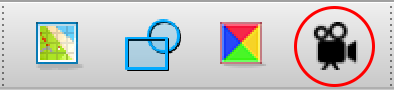

# Animations

In Tiled, animations are assigned to tiles within the [spritesheet](tilesets). To an assign an animation to a tile, select a tile — preferably something indicative of what the animation will be, such as a first step for a walking animation — and press the button for the animation editor, which looks like a movie camera:

You will then see a second window for assigning frames to your animation. Set the frame duration (in milliseconds), then double click on the desired tile to add it as a frame to the animation. You can adjust the timing of the frames or move/remove frames as you like, and you'll be able to see your changes live in the preview directly below.

## MGE Animation Considerations

For [character entities](entity_types#character-entity), you need not prepare an animation for all cardinal directions — e.g. there is only a fright/shock animation in *Chrono Trigger* for the south direction.

The [encoder](encoder) accommodates animation flipping with its [entity management system](entity_management_system), so you don't need sprite tiles for both left-facing and right-facing sprites if you're comfortable with mirroring your left-facing and right-facing sprites.

The Mage Game Engine (MGE) animation system requires that each animation have at least two frames, though, so for animations that aren't actually "animated," you might set two of the same frame back-to-back. #verifythis

## Animation Types

Three types of animations are built into the MGE for [character entities](entity_types#character-entity), and they are triggered in straightforward and predictable ways. [`entity_types.json`](mage_folder#entity_types-json) defines which animations are of which type, and they can be defined and adjusted within the [encoder](encoder) or manually with a text editor.

### Idle

This is what the character entity does by default.

Usually the idle consists of long periods of stillness, followed by a brief fidget: a blink, a small movement of the head, a sheep chewing its cud etc. For flying entities, the idle will likely consist of the entity hovering in place.

The idle animation does not include things like turning around to face different things, nor should it include multiple kinds of fidgets that interact with complex timing. If you want an entity to do more complex behaviors when idle, including facing somewhere specific or playing back other kinds of animations once in a while (a sheep that performs a chewing animation twice a second but lowers its head to chomp a fresh mouthful of grass every 15 seconds), consider using an [`on_tick`](script_slots#on-tick) script to [handle](techniques/handlers) this instead.

Entities look far more alive with an idle animation, even if it's just an occasional blink. Regardless, while the entity need not *appear* to have an idle animation, the MGE still expects one, so you should define one, even if it's just the same two frames back-to-back.

Idle animations are expected to loop seamlessly.

::: tip Best Practice
To avoid robotic synchronization between entities, try to stagger their animation timings by setting the `current_frame` property for that entity on their Tiled map or via [SET_ENTITY_CURRENT_FRAME](actions/SET_ENTITY_CURRENT_FRAME) inside a [script](scripts).
:::

### Walking

This animation plays when entities move within the game. For flying or hovering entities without an explicit walk cycle, you can simply re-use the idle animation.

Walking animations are expected to loop seamlessly.

### Action

This animation plays for the player character when the player presses the "action" button. It can also be deliberately triggered for arbitrary character entities via a script.

::: tip Best Practice
The engine uses the modulo of the animation index for playback, so if there is no action animation defined, likely the idle animation will play instead. If the idle animation is quite long, this means the entity will be frozen in place, doing apparently nothing, for some time. (For the player character, this also prevents the player from moving or doing anything else until the animation is finished.) Therefore, it's best to provide an action animation, even if there aren't sprite tiles prepared specifically for an action animation. Our recommendation is to copy the fidget portion of the idle and to keep it brief.
:::

Action animations are not expected to loop. Instead they are expected to interrupt the idle/walk animation, play once, and then the idle/walk animation will resume.

### Additional Animations

You can add additional animations after the first three, too, as you like.

Keep in mind that these animations can only be deliberately triggered by scripts, either for an arbitrary number of loops with [PLAY_ENTITY_ANIMATION](actions/PLAY_ENTITY_ANIMATION), or indefinitely with [SET_ENTITY_CURRENT_ANIMATION](actions/SET_ENTITY_CURRENT_ANIMATION).

Any animation set this way will be overridden by the walk animation if the character entity is compelled to move, and the entity will return to its idle after the walk motion is completed. Teleports don't count as "movement" in this case because entities don't switch to their walking animation when teleported.

## Animation Transitions and Vamping

An action animation cannot be started and held (or [vamped](https://en.wikipedia.org/wiki/Ostinato#Musical_theater)) for an indeterminate length of time. If you want an action animation to behave this way, you'll need to split the animation into three pieces: the start transition, the "vamp," and the end transition. Trigger each with a script:

- [PLAY_ENTITY_ANIMATION](actions/PLAY_ENTITY_ANIMATION) with a `play_count` of `1` for the start transition
- [SET_ENTITY_CURRENT_ANIMATION](actions/SET_ENTITY_CURRENT_ANIMATION) for the "vamp," or the portion you want to repeat for an indeterminate amount of time
- [PLAY_ENTITY_ANIMATION](actions/PLAY_ENTITY_ANIMATION) with a `play_count` of `1` for the end transition

See Strong Bad in the Bob-Only Club cutscene in BMG2020 for an example of this approach.

## MGE Animation Timing

Requirements:

- Animations must have less than 256 total frames.
- Frames must be less than 65,535 milliseconds long.

Animation frames will play for a minimum of one game frame regardless of duration (which, on the badge hardware, is currently in the ballpark of 130 ms, or 8 fps), so animations might play back very slowly in practice if you are frequently using short durations.

::: tip Best Practice
Because animations are not aborted when a character entity faces a new direction (it picks up where it left off in the new direction), it is beneficial to keep each animation of the same type completely uniform in terms of frame count and frame duration. This includes animations with fewer unique frames than others of its type, such as an animation from behind (where the face is obscured).
:::

In addition, we recommend making sure each animation of the same type uses the same tile rows for each frame, even if some of the tiles within the column are technically identical, so that future changes to any of the previously identical frames will not create the need for timing adjustments.

## Assigning Animations to Character Entities

For [character entities](entity_types#character-entity), animations are assigned to an animation type (idle, walk, etc.) and a cardinal direction (north, east, etc.) elsewhere; this cannot be done with Tiled. The [entity management system](entity_management_system) in the [web encoder](encoder#web-encoder) can help you assign animations to character entities if you don't want to do it by hand.
