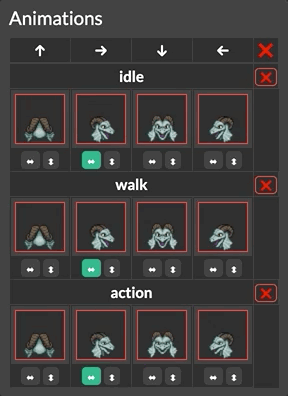
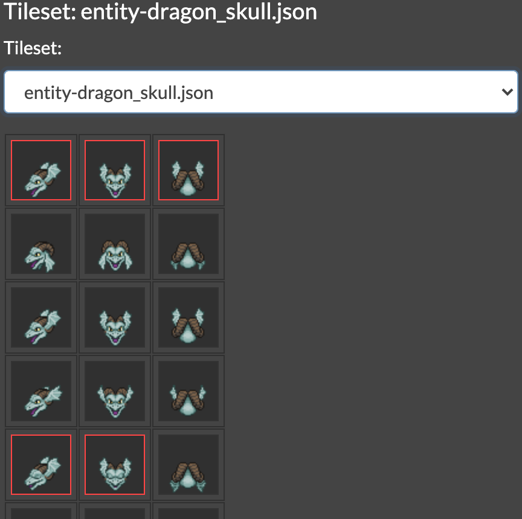

# Entity Management System

The Entity Management System is a tool to assign [animations](animations) (created with Tiled) to [character entities](entity_types#character-entity). This allows entity behavior to change its current animation, e.g. walking vs idle, pointing north/east/south/west.

To use the Entity Management System, launch the [web encoder](encoder#web-encoder) and upload your [`scenario_source_files`](mage_folder#scenario_source_files) folder.

::: warning
Changes you make using these tools are not automatically perpetuated to the encoded `game.dat`, nor are they automatically saved to your filesystem. To make your changes permanent:

1. Click the "Copy" button in the red box to put the new [`entity_types.json`](mage_folder#entity_types-json) content into your clipboard.
2. Manually paste into your [`entity_types.json`](mage_folder#entity_types-json) file, replacing all previous content.
3. Run the encoder again.
:::

## New `entity_type`

To assign animations to a new [character entity](entity_types#character-entity):

1. Place a tile from the tileset somewhere in one of your game maps. This ensures the encoder will find it.
2. Open the Entity Management System.
3. In the "Entity Type Editor," type the name of the new `entity_type` (character entity) you wish to create, then click "Create."
4. Select the tileset you wish to use from the drop-down list.
5. The animations pane and tileset pane will now appear.

## Existing `entity_type`

To edit an existing `entity_type` ([character entity](entity_types#character-entity)), choose one with the drop-down list, and then the animation and tileset panes will appear.

## Animations Pane

- There is one animation tile slot for each cardinal direction: north, east, south, west.
- You can click the arrows underneath the tile to horizontally or vertically flip it. Click again to reverse the flip.
- An entity's first three animations will be interpreted as their idle, walk, and action animations. Each entity should have at least these three.
	- To add another animation, press the "Add Animation" button at the bottom of the animations pane. Note that the Entity Management System will not add more after a certain point, but more may be added by hand, and these *can* be managed with the Entity Management System.
	- Click the red X at the right of an animation to remove it.
- Animation names cannot be changed with this tool.
	- Scripts cannot target animations by name, so naming them is not strictly necessary. It's often useful to be able to identify which one is which, however, so you may want to edit their names by hand.

## Tileset Pane

The tileset pane will show every tile in the tileset JSON file. Animation tiles are outlined in red.

You can change the tileset at any time with the drop-down list.

## Assigning Animations

Animations will use the first tile in the tileset by default.

To assign tiles to entity animation slots, click on animation tile in the animations pane (on the left), then click a tileset tile in the tileset pane (on the right).

Selected tiles are outlined in green.
