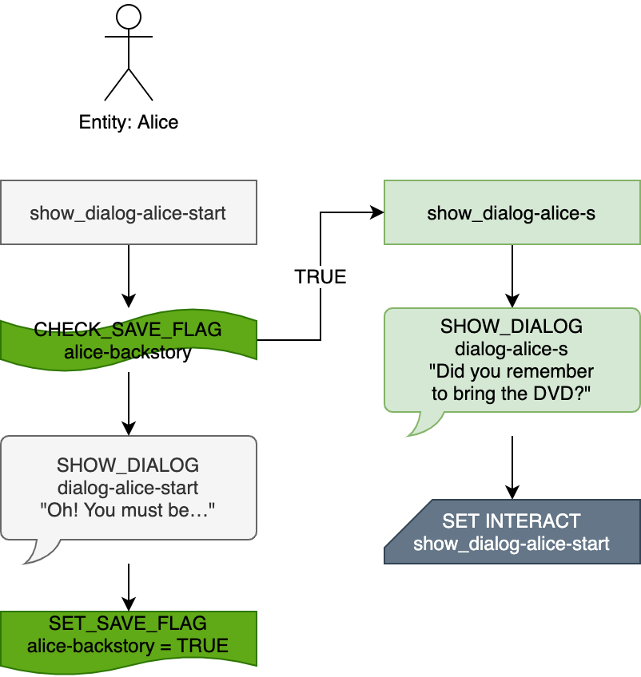

# Scripts

A **script** is an array of [actions](actions) which will execute one after the other, top to bottom, when the script is run.

It doesn't strictly matter which file contains which script data, as long as the file is of the right type (either JSON or [MGS Natlang](mgs/mgs_natlang)). Scripts therefore must have completely unique names, even if they are inside different script files, or are in different types of script files.

## Relative References

See: [Relative Entity References](entities/relative_references)

For all actions, [`%SELF%`](relative_references#self) refers to the entity running the script and [`%PLAYER%`](relative_references#player) refers to the player entity.

::: tip Best Practice: `%SELF%` or the entity's given name?
Scripts involving only one entity (or one entity and the player) will do best to use `%SELF%`. For [cutscenes](techniques/cutscenes) involving multiple characters, however, you might want to specify the entity specifically (by its given name) in case you have to change which entity is running the script.
:::

## `null_script`

The only built-in [script](scripts) in the Mage Game Engine. This script contains no actions.

A script can set any normal [script slot](script_slots) to `null_script` with any of the normal script-controlling actions, and can change itself to `null_script` by using [RUN_SCRIPT](actions/RUN_SCRIPT).

## JSON Structure

::: warning Deprecated Info
`goto index` and other features of [MGS Natlang](mgs/mgs_natlang) make this kind of script management unnecessary; this section belongs in a museum!
:::

```json:line-numbers
{
  "show_dialog-alice-start": [
    {
      "action": "CHECK_SAVE_FLAG",
      "save_flag": "alice-backstory",
      "expected_bool": true,
      "success_script": "show_dialog-alice-summary"
    },
    {
      "name": "SHOW_DIALOG",
      "dialog": "dialog-alice-start"
    },
    {
      "name": "SET_SAVE_FLAG",
      "save_flag": "alice-backstory",
      "bool_value": true
    }
  ],
  "show_dialog-alice-summary": [
    {
      "name": "SHOW_DIALOG",
      "dialog": "dialog-alice-summary"
    },
    {
      "name": "SET_ENTITY_INTERACT_SCRIPT",
      "entity": "%SELF%",
      "script": "show_dialog-alice-start"
    }
  ]
}
```

We want Alice to give her backstory the first time you speak to her, and a summary of her backstory thereafter.

When we interact with Alice, her [`on_interact`](script_slots#on-interact) script is run: `show_dialog-alice-start`, which is found on line 2. During the course of this script, we set a save flag (`alice-backstory`) to `true` (line 14). After the last action is run, the script ends.

The next interaction will run the last `on_interact` script used, which happens to be her start script again. But this time, since `alice-backstory` is `true`, the script immediately branches, and instead the game runs the script called `show_dialog-alice-summary`, found on line 19.

After showing the alternate dialog, the script sets Alice's `on_interact` script to her start script (line 25). Note that if we didn't do this, interacting with her after hearing her backstory summary would result in `show_dialog-alice-summary` being run again, which in this case is actually what we want. But if there were more than one branch in Alice's logic, failing to reset the `on_interact` would result in the other branches being completely ignored. Therefore, all branches should end by setting the entity's `on_interact` script to their start script.



For scripts with very complex branching, it can be beneficial to plot them out (and color code them!). This chart was done with [diagrams.net](https://app.diagrams.net/), but other graphics software (or a pen and paper) might be used instead.

For subsequent examples, I'll be using this flow-chart-esque format to demonstrate script behaviors. For these charts, each column represents a different script (named at the top of each column by a rectangle), and the script under the stick figure indicates the entity's default `on_interact` script.
