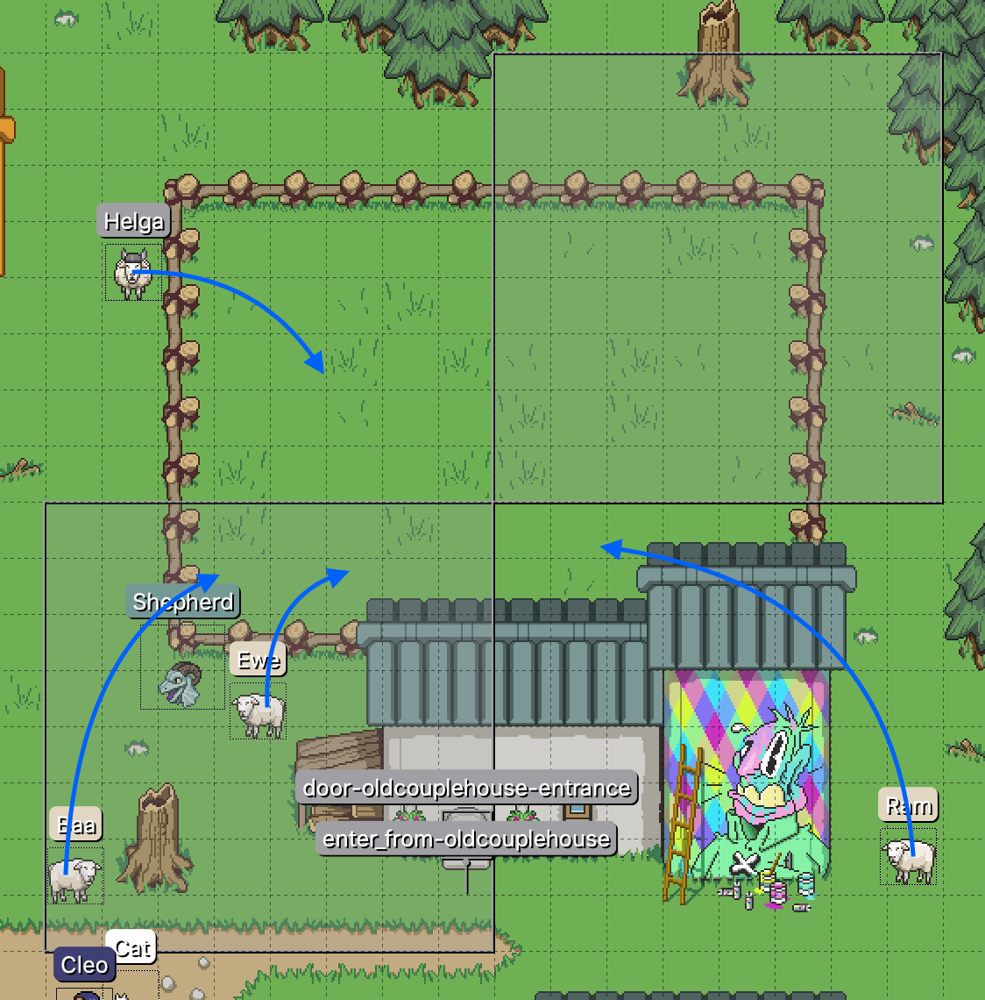

# Coordinate Considerations

If designing a puzzle involving X and Y coordinates, you should keep the global [map](../maps) coordinate space in mind when placing [entities](../entities), [triggers](../vector_objects), etc. Each coordinate spans two bytes, so map distances greater than 256 pixels (horizontal or vertical) are guaranteed to involve the more significant byte of the pair, which can be confusing to players not familiar with little endian byte order.

Distances smaller than 256 can involve this byte, too, depending on where things fall. If you find your puzzle has unintentionally crossed a 256px boundary, you can adjust the map size (and reposition all existing elements relative to the new bounds) to move the puzzle to coordinates more in scope of the target difficulty.

## Example

To design and manage puzzles meant only to involve the least significant byte, you could count map tiles for each puzzle element (keeping in mind your map's tile size), but it might be easier to draw a 256 x 256 vector rectangle (or a series of them) where the puzzle is to take place.

 

Lock the layer containing this vector guide and/or place it below all other object layers to keep it from preventing you from selecting other elements in Tiled.
