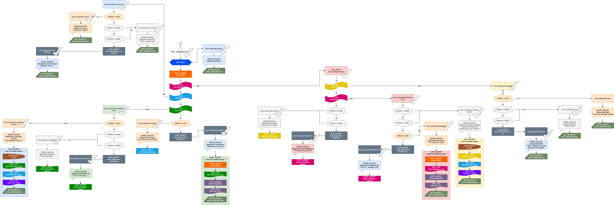

# Grand Finale (Beatrice)

::: warning DEPRECATED
This page is deprecated and likely very out of date!

Large scripts like this were a major reason we created [MGS Natlang](../mgs/mgs_natlang). Now we can use [if and else](../mgs/advanced_syntax/if_and_else) like a normal programming language. (To that point: converting this mess to natlang revealed a few redundant logic paths, even after multiple revisions of this flowchart!)
:::

In the BMG2020, Beatrice's branching was complicated, and was very difficult to debug. But by mapping and color coding the scripts like this I was able to easily identify which sequence of actions were repeated and could be split off into wrapup scripts, and I could more easily see how I needed to arrange the branching to produce the correct behavior. (The map itself was used for planning purposes only and is out of date at this point. E.g. hints are now managed with a single [integer](../scripts/integer_variables) instead of a bajillion [save flags](../scripts/save_flags).)

## Beatrice's Branching

First comes the glitch check, overriding everything else. When she is glitched, all other aspects of branching and story status are ignored.

Next, she faces the player. This behavior is the same for all remaining branches, so is done before any other branching.

Then the largest split: determining which quest line the player is on. This cuts puts the rest of her scripts into one of two categories, and all subsequent scripts are named accordingly: `bea1` or `bea2`.

The next logic check is a more of a standard entity branch: if the quest line is done, the script jumps to a branch where Beatrice says things like "Oh, thank you for fixing my husband!" or "Oh my God, why is he a sheep again?!"

If the quest line is unfinished, the script will instead check as to whether the backstory has been heard before, which determines whether the player hears the short/summary (`-s`) version of the dialog or the long version (`backstory`).

And if *that* wasn't enough branching, most of the branches will then *also* branch depending on the status of her husband: whether he's either type of sheep entity, a man, or anything else. She says something different (and perhaps clever) in each variation, though each script will still end in one of the same ways: the backstory will have been heard, and the quest line will have either been solved or left unsolved.

## Beatrice's Wrapup Scripts

### `bea-wrapup-mini`

Sets Beatrice's [`on_interact`](../scripts/on_interact) script back to her start script. This is the most basic shared wrapup behavior, and it was split mostly to future proof the branching against further complications. All of Beatrice's branches run this script, or run a script that runs it. (The chart above does not reflect this wrapup split, and still reflects the original `on_interact` reset placement.)

### `bea1-complete-wrapup`

This is the wrapup script for solving Beatrice's first quest line.

- sets her [`on_tick`](../scripts/on_tick) to [null_script](../scripts/null_script) and turns her toward her husband
- sets the `bea1` backstory and `bea1` [story flag](../scripts/save_flags) to `true`
- zeroes the target hint
- runs `bea-wrapup-mini` to finish

Every branch that ends with solving her first quest line will run this script at the end, including branches that might have already set her backstory flag or might have branched due to the backstory flag being set to `true`, but the flag is set anyway in this script to simplify the logic in general — setting it `true` a second time won't ruin anything, and it means there doesn't have to be a separate wrapup script for not setting that flag. This decision was easy to make once I had everything mapped and color coded.

### `bea1-incomplete-wrapup`

This is the script that runs if you interacted with Beatrice but did not solve her first quest line.

- copies the script `set_tick-watch-player`, which sets her `on_tick` to `face-player`
- sets the `bea1` backstory flag to `true`
- sets the targeted hint to her first quest
- runs `bea-wrapup-mini` to finish

Like the above script, this script is sometimes run at the end of scripts that have already set the backstory flag or branched due to that flag already being `true`, but it's simpler to set it in all cases.

In addition, there are two other wrapup scripts for the second quest line (`bea2`): `bea2-complete-wrapup` and `bea2-incomplete-wrapup`, which mirror their `bea1` counterparts.

## Other Common Beatrice Behavior

In many of the dialog segments, Beatrice turns to take a good long look at her husband, and there's a specific pattern of timing before and after the turn. During the turn, player control is temporarily disabled.

A separate script for this common behavior was invoked with [COPY_SCRIPT](../actions/COPY_SCRIPT) each time it was needed during a dialog script so that the timing could be tuned in one place instead of everywhere it occurred. (This was left out of the script branching map because it didn't concern branching logic.) Specifically, this behavior was designed before the frame rate of the hardware was known and before consistent timing on the hardware and the desktop build was implemented, so while a long slow turn might be in-character for an old woman, at the time it anticipated a genuine need to make the choreography feel more natural. We've found, however, that such careful timing isn't that important for most entity conversations.
