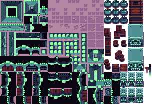
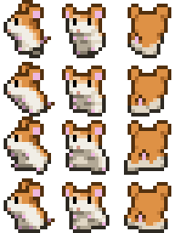

# Tilesets

A tileset is a series of images on a grid of uniform size used to modularly create larger images.

## Map Tilesets

Map tilesets contain square blocks of terrain which can be used for building the [world](maps). There is no required structure for how the tiles should be arranged, but ordinarily, similar tiles are placed near each other. A map tileset is not expected to be animated.

All **tileset tiles need to be perfect squares** because tiles can be rotated or flipped on either axis when building maps.

## Spritesheets

**Spritesheets** are tilesets that contain every iteration of a sprite needed for its animations.

Spritesheets are handled like tilesets within Tiled and the [MGE encoder](encoder/mge_encoder). They are not required to be square, but non-square spritesheets are currently (as of Nov 2023) bugged, and may crash the game once the tile goes offscreen, so best to keep everything square for now.

Due to the way Tiled defines animations, the order of the sprites in the spritesheet doesn't matter, but for DC801 black mage game we tend to have one sprite tile for the side view, front view, and back view on one row, going down the image in a series of rows.

## Other Kinds of Tilesets

You'll need to make tilesets in Tiled for dialog box skin(s) and entity talk portraits, too.

Beyond making sure the tiles are the right size, you do not need to do anything special to these files.

Put dialogSkin files in `scenario_source_files/tilesets/` and entity portraits in `scenario_source_files/entities/`. (See: [scenario_source_files](getting_started/scenario_source_files))

## MGE Considerations

### Tile Size

For tilesets and spritesheets, tiles **should not exceed 128x128 in size** or the game may not run on the badge hardware.

If you need to play animations larger than this, such as an animated logo on a menu screen, you can split the tile into several pieces and place them on a map in such a way that they appear to be a single unit. (This won't work for entities that need to move around on their own, however.)

### Transparency

**You cannot have partially transparent pixels**. Semi-transparent pixels are assigned by the [MGE encoder](encoder/mge_encoder) to be either fully opaque or fully transparent at a 50% threshold.

To encode alpha, the MGE repurposes the least-significant green bit in the RGB565 color encoding scheme. Because of this, the color 0x0200 (hex #004000, or rgb 0,64,0) will actually manifest as transparent within the MGE. Avoid using this color (or any color that becomes 0x0200 when converted to RGB565).

### Pallet

The [MGE encoder](encoder/mge_encoder) indexes the pallets of each image, and there is therefore a **maximum of 256 colors per tileset image**. If you need extra colors, consider splitting the tileset into multiple files — maps will quite happily use tiles from multiple tilesets with no trouble, provided the tiles are the correct size. The MGE encoder will let you know if one of your tilesets is over the color limit.

**Best Practice:** On embedded, pixel data is streamed from the ROM chip, but the tileset pallets must be held in RAM. Because RAM is very, very precious, **please combine tilesets if there isn't a compelling reason to keep them in separate files**. Entity sprite sheets are typically kept separate, for instance, but you might combine spritesheets for similar entities, or combine all character entity portraits. (And naturally, tilesets with differing tile sizes must be separate!)

### Updating Tileset Images on the Fly

When you save changes to an image that Tiled is actively using, including changing its dimensions, the graphical changes are instantly reflected in all maps, tilesets, etc. within Tiled. This way, you can rapidly iterate on how something looks.

However, changes in image dimensions are *not* automatically perpetuated to the tileset's declared properties, and since the [MGE encoder](encoder/mge_encoder) relies on those values to determine the tileset's size, this will cause problems: for tiles past the tileset's declared bounds, the pixel data will behave correctly, but random [tile collisions](tilesets/tile_collisions) will be applied.

**Solution**: Make any change whatsoever to the tileset inside of Tiled to have it recalculate those properties, then save. Alternatively, change the numbers yourself in a text editor.
