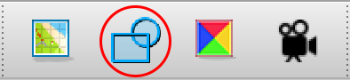

# Tilesets

A tileset is a series of images on a grid of uniform size used to modularly create larger images.

## Map Tilesets

Map tilesets contain square blocks of terrain which can be used for building the [world](maps). There is no required structure for how the tiles should be arranged, but ordinarily, similar tiles are placed near each other. A map tileset is not expected to be animated.

All **tileset tiles need to be perfect squares** because tiles can be rotated or flipped on either axis when building maps.

## Spritesheets

**Spritesheets** are tilesets that contain every iteration of a sprite needed for its animations.

Spritesheets are handled like tilesets within Tiled and the [encoder](encoder). They are not required to be square, but non-square spritesheets are currently (as of Nov 2023) bugged, and may crash the game once the tile goes offscreen, so best to keep everything square for now.

## Other Kinds of Tilesets

You'll need to make tilesets in Tiled for dialog box skin(s) and entity talk portraits, too.

Beyond making sure the tiles are the right size, you do not need to do anything special to these files.

Put dialogSkin files in `tilesets/` and entity portraits in `entities/`. (See: [`scenario_source_files`](getting_started/mage_folder#scenario_source_files))

## MGE Considerations

### Tile Size

For tilesets and spritesheets, tiles **should not exceed 128x128 in size** or the game may not run on the badge hardware.

If you need to play animations larger than this, such as an animated logo on a menu screen, you can split the tile into several pieces and place them on a map in such a way that they appear to be a single unit. (This won't work for entities that need to move around on their own, however.)

### Transparency

**You cannot have partially transparent pixels**. Semi-transparent pixels are assigned by the encoder to be either fully opaque or fully transparent at a 50% threshold.

To encode alpha, the MGE repurposes the least-significant green bit in the RGB565 color encoding scheme. Because of this, the color 0x0200 (hex #004000, or rgb 0,64,0) will actually manifest as transparent within the MGE. Avoid using this color (or any color that becomes 0x0200 when converted to RGB565).

### Pallet

The [encoder](encoder) indexes the pallets of each image, and there is therefore a **maximum of 256 colors per tileset image**. If you need extra colors, consider splitting the tileset into multiple files — maps will quite happily use tiles from multiple tilesets with no trouble, provided the tiles are the correct size. The encoder will let you know if one of your tilesets is over the color limit.

::: tip Best Practice
On embedded, pixel data is streamed from the ROM chip, but the tileset pallets must be held in RAM. Because RAM is very, very precious, **please combine tilesets if there isn't a compelling reason to keep them in separate files**. Entity sprite sheets are typically kept separate, for instance, but you might combine spritesheets for similar entities, or combine all character entity portraits. (And naturally, tilesets with differing tile sizes must be separate!)
:::

### Updating Tileset Images on the Fly

When you save changes to an image that Tiled is actively using, including changing its dimensions, the graphical changes are instantly reflected in all maps, tilesets, etc. within Tiled. This way, you can rapidly iterate on how something looks.

However, changes in image dimensions are *not* automatically perpetuated to the tileset's declared properties, and since the [encoder](encoder) relies on those values to determine the tileset's size, this will cause problems: for tiles past the tileset's declared bounds, the pixel data will behave correctly, but random [tile collisions](tilesets#tile-collisions) will be applied.

**Solution**: Make any change whatsoever to the tileset inside of Tiled to have it recalculate those properties, then save. Alternatively, change the numbers yourself in a text editor.

## Creating a Tileset JSON File

The [encoder](encoder) cannot use image files outright — there must be an associated JSON file (made with Tiled) that explicitly defines the image file path and various other properties.

Within Tiled:

1. Go to "File > New Tileset…"
2. Name the file. Prefix the name with `tileset-` or `entity-` as appropriate.
3. For "source," use the file explorer to choose the sprite sheet or tileset you want to use. (Please make sure the image file is in its final destination ahead of time. Moving it after assigning it can be a bit of a hassle.)
4. Set the tile width and height to the tile size of your image.
5. Save the tileset file:
	- Set the format to JSON.
	- Set the correct destination folder: `scenario_source_files/entities/` for entities and their portraits, and `scenario_source_files/tilesets/` for everything else. (Keep in mind that Tiled will default to the file path of the last file currently open!)

**Alternative method (advanced)**: if you are making pallet variations of the same sprite, and every other aspect (apart from the name and the image) are the same, you might copy the original tileset JSON file and manually change whatever is different between them.

### For Character Entities

All tiles within a [character entity](entity_types#character-entity) tileset must have the `Class` (formerly `Type`) property set to its `entity_type` name. You can find the "Class" property in the Properties view (i.e. panel/pane/frame), which you can make visible (if currently invisible) via "View > View and Toolbars > Properties."

::: tip
You can skip this part if you don't need the entity to be a character entity — if you want to leave it as an animation entity, such as a flickering candle or waving grass, it doesn't need to have an `entity_type` name at all.

See: [Entity Types](entity_types)
:::

### Tile Collisions

[Map](maps) [tilesets](tilesets) should have collision polygons set for each relevant tile. This is done by selecting a tile and clicking the collision editor within Tiled:

For the MGE, each tile can have only one vector shape, and each vertex must fall within the bounds of the tile itself. (Vertices falling outside the tile will cause erratic collision behavior.)

It's helpful to turn on pixel snapping before drawing collision polygons ("View > Snapping > Snap to Pixels").

::: tip Best Practices
Very precise collision shapes are possible, but best practice is to avoid very concave shapes and to avoid diagonals for tiles that are expected to be placed adjacent to other tiles with collision.

When defining your collision polygons and designing your maps, it's good to test the tiles in their map contexts and determine whether the player character is able to push themselves inside one of these shapes.
:::
