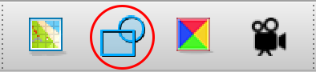

# Tile Collisions

[Map](../maps) [tilesets](../tilesets) should have collision polygons set for each relevant tile. This is done by selecting a tile and clicking the collision editor within Tiled:

For the MGE, each tile can have only one vector shape, and each vertex must fall within the bounds of the tile itself. (Vertices falling outside the tile will cause erratic collision behavior.)

It's helpful to turn on pixel snapping before drawing collision polygons ("View > Snapping > Snap to Pixels").

## Collision Best Practices

Very precise collision shapes are possible, but best practice is to avoid very concave shapes and to avoid diagonals for tiles that are expected to be placed adjacent to other tiles with collision.

When defining your collision polygons and designing your maps, it's good to test the tiles in their map contexts and determine whether the player character is able to push themselves inside one of these shapes.
