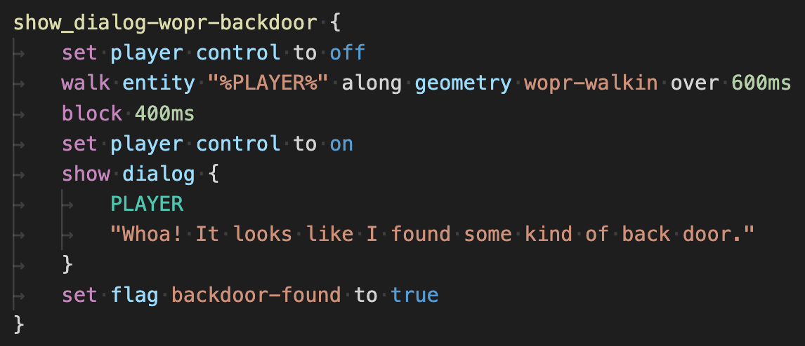

# MageGameScript Natlang <!-- This README is automatically generated, NO TOUCHY -->

A simplified approach to writing game content for the DC801 Black Mage Game Engine (MGE).

- The MGE encoder itself still needs its input in the form of JSON; however, exporting MGS Natlang to JSON is straightforward.
- A syntax coloring grammar is in development:
	- original: `mgs.tmLanguage.json` (JSON)
	- for Sublime Text: `mgs.tmLanguage` (XML)
	- for Visual Studio Code: `magegamescript-colors.vsix` (VSCode plugin)



## MGS Natlang vs JSON

### Original script JSON:

```json
{
	"on_tick-greenhouse": [
		{
			"action": "CHECK_IF_ENTITY_IS_IN_GEOMETRY",
			"entity": "%PLAYER%",
			"geometry": "door-greenhouse",
			"success_script": "leave-greenhouse",
			"expected_bool": true
		},
		{
			"action": "COPY_SCRIPT",
			"script": "ethernettle-uproot-check",
			"comment": "some kind of comment"
		}
	]
}
```

While relatively human readable, the above is difficult to write in practice.

- It's bulky enough that you can't have very much scripting logic on your screen at once.
- It's easy to lose track of what you're doing as you must constantly reference named scripts and dialogs (and serial dialogs) in different files back and forth.
- JSON cannot be commented, so it's inconvenient to leave yourself supplementary information, such as the contents of a dialog you're referencing when scripting a cutscene in a script file.
- The parameters for MGE actions are not highly uniform, so it's easy to forget or confuse parameters if you're not copying and pasting actions from nearby.

### MGS Natlang (script):

```
on_tick-greenhouse {
	if entity "%PLAYER%" is inside geometry door-greenhouse
		then goto leave-greenhouse
	copy script ethernettle-uproot-check // some kind of comment
}
```

Apart from the fact that the MGS Natlang won't receive any syntax coloring by default, this is more approachable.

It's more compact, and the nested relationship of the script and its actions is far easier to see at a glance. Human-friendly grammar constructions (e.g. `is inside` vs `is not inside`) makes it much easier to follow script branching logic.

The syntax is flexible:

- White space agnostic.
- Many strings can be unquoted or quoted freely (though anything with a space or any unusual character *must* be wrapped in quotes). Double or single quotes are both fine.
- Many words are optional, and can be included either to increase logical clarity or omitted to decrease word density, e.g. `goto script scriptName` vs `goto scriptName`.
- Certain variables can be formatted in multiple, human-friendly ways, e.g.
	- duration: `1000ms` or `1s` or `1000`
	- quantity: `once` or `1x` or `1`

### Original dialog JSON

```json
{
	"exampleDialogName": [
		{
			"alignment": "BOTTOM_LEFT",
			"entity": "Trekkie",
			"messages": [
				"Me want to wish you a happy birthday,\n%PLAYER%."
			]
		},
		{
			"alignment": "BOTTOM_RIGHT",
			"entity": "%PLAYER%",
			"messages": [
				"Aww, gee, thanks, Farmer\n%Trekkie%!"
			]
		}
	]
}
```

Dialog JSON is more uniform than script JSON is, but its information density is even worse.

### MGS Natlang (dialog):

```
settings for dialog {
	defaults {
		alignment BL
	}
	parameters for label PLAYER {
		entity "%PLAYER%"
		alignment BR
	}
}
```

With MGS Natlang, you can create presets for common dialog settings. As a result, the dialogs themselves are very lightweight, making it effortless to read and write large swaths of them:

```
dialog exampleDialogName {
	Trekkie
	"Me want to wish you a happy birthday, %PLAYER%."

	PLAYER
	"Aww, gee, thanks, Farmer %Trekkie%!"
}
```

And since MGS Natlang is whitespace agnostic, it can become as compact as you want:

```
dialog exampleDialog2 {
	PLAYER "Neat."
}
```

or even

```
dialog exampleDialog2 { PLAYER "Neat." }
```

### MGS Natlang (combined):

However, where MGS Natlang really shines is in combining both script data and dialog data together:

```
settings for dialog {
	parameters for label PLAYER {
		entity "%PLAYER%"
		alignment BR
	}
}
show_dialog-wopr-backdoor {
	set player control to off
	walk entity "%PLAYER%" along geometry wopr-walkin over 600ms
	wait 400ms
	set player control to on
	show dialog {
		PLAYER "Whoa! It looks like I found some kind of back door."
	}
	set flag backdoor-found to true
}
```

Now the dialog's content is no longer separated from its context. The dialog no longer needs a name, either, unless another script needs to refer to it, too.

## MGS Natlang block structure

MGS Natlang currently has several types of blocks, each with their block contents enclosed in a pair of matching curly braces:

```
<BLOCK DECLARATION> { <BLOCK BODY> }
```

Some block types can (or must) be nested within others, but blocks cannot be nested arbitrarily.

Unless otherwise marked, assume all entries in the following list are allowed in any quantity (including zero). Numbered items must be given in exactly that order, but all other items can occur in any order within their parent block.

### Nesting structure

- **dialog settings block**
	- **dialog settings target block**
		- **dialog parameter**
- **dialog block**
	- **dialog**
		1. **dialog identifier** (exactly 1)
		2. **dialog parameter**
		3. **dialog message** (at least 1)
		4. **dialog option**
- **script block**
	- **action**
	- **show dialog block**
		- **dialog**
			1. **dialog identifier** (exactly 1)
			2. **dialog parameter**
			3. **dialog message** (at least 1)
			4. **dialog option**

## Block types

In the following definitions, words in parentheses are optional, and words starting with dollar signs are variables. (See [MGS Natlang variables](#mgs-natlang-variables) for how to interpret variables in these MGS Natlang definitions.)

### Dialog settings block

- **Parent block:** none
- **Block body:**  any number of [dialog settings target blocks](#dialog-settings-target-block) (in any order)
- **Syntax:** `settings (for) dialog {}`

Dialog settings are applied to dialogs in order as the parser encounters them; a dialog settings block partway down the file will affect only the dialogs afterward, and none before.

New settings will override old settings, entity settings will override global settings, and label settings will override entity settings [verify this]. (Parameters given in a dialog's body will override any other settings, however.)

### Dialog settings target block

- **Parent block:** [dialog settings block](#dialog-settings-block)
- **Block body:** any number of [dialog parameters](#dialog-parameters) (in any order)
- **Syntax**: `(parameters) (for) <TARGET> {}`

Several choices for `TARGET`:

- `(global) default(s)`
	- Describes the default behavior for all dialogs in the same MGS Natlang file.
	- Of all MGE dialog parameters, only `alignment` is 100% required, so this is a good parameter to include at the global level.
- `entity $entityName:string`
	- Describes the default dialog settings for **$entityName**.
- `label $labelName:bareword`
	- Defines a dialog identifier shortcut or alias to a specific set of settings.
	- **$labelName** *must* be a bareword.
	- Dialog labels only exist in MGS Natlang (not the MGE itself), and they do not apply to other entity references (such as the target of an action).

#### Example dialog settings target block:

```
parameters for label PLAYER {
	entity "%PLAYER%"
	alignment BR
}
```

This is a common use case for dialog settings, after which dialog messages for the player character can be identified with `PLAYER` instead of `entity "%PLAYER%"`.

#### Dialog parameters

- **Parent block:** [dialog settings target block](#dialog-settings-target-block) or [dialog block](#dialog-block)
- **Syntax:** any of the following:
	- `entity $value:string`
		- **$value**: the "given name" of the entity (i.e. the entity's name on the Tiled map). (Wrapping this name in `%`s is entirely unnecessary and will in fact confuse the MGE encoder.)
			- Can be `%PLAYER%` or `%SELF%`, however.
		- A dialog can inherit a `name` and a `portrait` if given an `entity` parameter. (The entity must be a "character entity" for a portrait to be inherited.)
		- The inherited `name` is a relative reference; the dialog display name will be whatever that entity's name is at that moment.
	- `name $value:string`
		- **$value**: a fixed string (max 12 ASCII chars) that the dialog will always display, regardless of any entity's status. For a relative name instead, wrap a specific entity's name in `%`s.
			- Can be `%PLAYER%` or `%SELF%`.
		- Overrides names inherited via the `entity` parameter.
		- **A dialog name of some sort is required, either via this parameter or the `entity` parameter.**
	- `portrait $value:string`
		- **$value**: the name of a MGE portrait.
		- Overrides portraits inherited via the `entity` parameter.
	- `alignment $value:string`
		- **$value**: one of the following:
			- `TR` (or `TOP_RIGHT`)
			- `BR` (or `BOTTOM_RIGHT`)
			- `TL` (or `TOP_LEFT`)
			- `BL` (or `BOTTOM_LEFT`) (default)
	- `border_tileset $value:string`
		- **$value**: the name of a MGE tileset.
		- The default is used if none is provided.
	- `emote $value:number`
		- **$value**: the id of the "emote" in that entity's entry in `portraits.json`.
		- The default emote (`0`) will display if not specified.
	- `wrap messages (to) $value:number`
		- **$value**: the number of chars to auto wrap the contents of dialog messages.
		- 42 is default.
		- Words wrapped in `$`s (variables) will always count as 5 chars, and words wrapped in `%`s (entity names) will always count as 12 chars.
	- `wrap options (to) $value:number`
		- [options don't wrap so why did I include this? lol]

### Dialog block

For dialog blocks that can be nested inside scripts, see [show dialog block](#show-dialog-block).

- **Parent block:** none
- **Block body:** any number of [dialogs](#dialogs), in the order they are to be seen in-game
- **Syntax:** `dialog $dialogName:string {}`

As these dialog blocks don't have any baked-in context, a **$dialogName** is required.

### Dialog

- **Parent block:** [dialog block](#dialog-block) or [show dialog block](#show-dialog-block)
- **Syntax:** in order:

1. `<DIALOG IDENTIFIER>` exactly 1
2. `<DIALOG PARAMETER>` 0+
3. `<DIALOG MESSAGE>` 1+
4. `<DIALOG OPTION>` 0-4x

#### **Dialog identifier**:

One of the following:

- `$value:bareword`
	- If there is no label by this **$value**, it is assumed to be an entity name. (Entity names with spaces or other special characters are not eligible for being used this way.)
	- NOTE: A quoted string is NOT allowed here!
- `entity $value:string`
	- **$value**: an entity's given name. (This also provides the entity name as an `entity` parameter for the dialog.) Can be wrapped in quotes or left bare.
	- `%PLAYER%` and `%SELF%` must use this pattern because they contain special characters. As this can be cumbersome, it's probably best to set up a dialog label for them so you can use a bareword for an identifier instead.
- `name $value:string`
	- **$value**: the dialog's display name. This also provides a `name` parameter for the dialog. Can be wrapped in quotes or left bare.

#### **Dialog parameter**:

See: [dialog parameters](#dialog-parameters)

#### **Dialog message**:

Any quoted string.

- Each message is a new "text screen" in the game.
- Only ASCII characters will be displayed.
- Insert a relative entity name by wrapping it in `%`s.
	- `%PLAYER%` and `%SELF%` are also allowed.
- Insert the value of a variable by wrapping its name in `$`s.
- Some characters must be escaped in the message body, such as double quote: `\"`
	- `\t` (tabs) are auto-converted to four spaces.
	- `\n` (new lines) are honored, but since text is wrapped automatically, don't worry about explicitly hard wrapping your messages unless you want to force the new lines to specific places.
	- `%` and `$` are printable characters unless used in pairs (within a single line), in which case the only way to print them is to escape them (e.g. `\%`).
- Word processor "smart" characters such as ellipses (…) or emdashes (—) are auto converted to ASCII equivalents (`...`) (`--`).

#### **Dialog option**

Syntax: `> $label:quotedString : (goto) (script) $script:string`

- You may have up to 4 dialog options per dialog.
- As each of these "branches" results in a script `goto`, no dialog messages afterward will be seen. Therefore, dialog options must come last within the dialog.
- The **$label** is what will be shown to the player. As the cursor (approximated with `>`) takes up some room, assume you will only have 39 characters instead of the usual 42.
	- The label behaves like dialog messages in terms of inserting variables (with `$` or `%`), escaped characters, etc.
	- Must be wrapped in quotes.
- In the MGE, dialog options are displayed underneath the final dialog message. Therefore, the last dialog message before any options should consist of a single line of no more than 42 characters.

#### **Example dialog block**

```
dialog exampleDialog {
	Bob
	"So I heard about this club...."

	Bob
	alignment BR
	"Oh, no. Don't you start."

	Bob
	"No, no, I swear! Hear me out!"
	> "Fine. What club?"
		: goto bobContinueScript
	> "(walk away)"
		: goto bobLeaveScript
	> "(smack %Bob% with a rubber chicken)"
		: goto bobNoveltyScript
}
```

### Script block

- **Parent block:** none
- **Block body:** any number of [actions](#actions) in the order they are to be executed in-game
	- some of these may be [show dialog blocks](#show-dialog-block)

See the [action dictionary](#action-dictionary) far below for detailed information on all non-SHOW_DIALOG actions.

### Show dialog block

- **Parent block:** [script block](#script-block)
- **Block body:** any number of [dialogs](#dialog), in the order they are to be seen in-game

(NOTE: because this dialog definition is doubling up as a "show dialog" script action, the word "show" is required for both.)

- `show dialog ($dialogName:string) {}`
	- **$dialogName** is unnecessary, but allowed if desired.
		- Internally, the JSON still requires a dialog name, but the MGS Natlang translator generates one based on the file name and line number if no dialog name is provided. For authors writing content in MGS Natlang exclusively, this will be entirely invisible.
		- Omitting dialog names for one-offs is recommended to keep things clean.
- `show dialog $dialog:string`
	- This syntax allows you to "call" a dialog without having to define it in place.
	- These dialogs may be defined elsewhere in the file (even further down) or in another file entirely. The MGE encoder, which sees all scripts and all dialogs at the same time, will be able to tell you if you're using "show dialog" for a dialog that hasn't been defined anywhere.
	- For these, it's perhaps best to leave a comment reminding you which dialog it is.

### Show serial dialog block

Serial dialog blocks will behave similarly to dialog blocks. (They are not yet fully implemented in MGS Natlang.)

### Comments

MGS Natlang also supports two kinds of comments, which can appear anywhere in the file and inside any block.

#### Inline comment

```
testScript {
	wait 1000ms
	wait 1000ms // inline comment
}
```

This is the only time that line breaks are syntactic in MGS Natlang — inline comments start with a double forward slash and end either with a line break or the end of the document.
	
The JSON to MGS Natlang translator will take extraneous properties from actions and the like and turn them into inline comments automatically.

#### Block comment

```
/*
Block comment:
Everything inside is a comment!
The lexer ignores it all! WHEEE
*/
```

Unfortunately, as the lexer ignores comments, there is no method of translating comments from MGS Natlang into "comments" in JSON.

## MGS Natlang variables

A variable's value is what populates the meat of the JSON output, but its type affects how each word is validated against patterns in the MGS Natlang syntax tree, and in most cases will also affect how the word may be formatted in the natlang.

The format for this documentation is `$` + variable name + `:` + type name.

The variable's name for most purposes doesn't matter much when writing MGS Natlang, except as a hint as to the variable's purpose. (It does matter when trying to analyze the JSON output, however.)

### Variable decay

A special property of variable types is "decay" — this means a variable of a specific type may satisfy a variable's requirement for a different type.

```
// action that wants a duration
testScript1 {
	wait 150ms // "duration" = ok
	wait 150   // "number" is fine, too (decays to "duration")
}

// action that wants a number
testScript2 {
	load slot 1   // "number" = ok
	load slot 1ms // "duration" won't work!
}
```

In most cases, human intuition is enough to predict whether a variable can decay into another type.

Most important to keep in mind is that a variable wanting to be a `string` will be satisfied by either a `bareword` string or a `quotedString` string, but `bareword`s and `quotedString`s cannot be substituted for each other.

### Variable types and examples

Note that all numbers must be whole numbers.

- `duration`
	- `1000ms`, `1s`
	- Seconds are translated into milliseconds automatically.
- `distance`
	- `32px`, `128pix`
- `quantity`
	- `1x`, `10x`
	- The barewords `once`, `twice`, and `thrice` also count as `quantity`.
	- Note that the `x` comes after the number, not before.
- `number`
	- `-1`, `100`
	- These may be negative.
- `color`
	- `#FFF`, `#FFDDEE`
	- Some bare color names will also work, e.g. `black` or `white`.
- `boolean`:
	- `true`, `yes`, `on`, `open`
	- `false`, `no`, `off`, `close`
	- Some actions will prefer specific pairs of booleans when being translated from JSON, but when translating the other way, any of the above words will work.
		- e.g. `set player control open` = `set player control on`
- `operator`
	- An exhaustive list:
		- equal sign: `=`
		- plus: `+`
		- hyphen: `-`
			- If a `-` is directly before a number, the number will become negative. Be sure to put a space between a `-` and a number if you want the `-` to be interpreted as an operator.
		- asterisk: `*`
		- forward slash: `/`
		- percent sign: `%`
		- question mark: `?`
		- curly braces: `{` and `}` (for block boundaries)
	- Actions that call for an operator will also accept the corresponding bare words `SET`, `ADD` etc.
- `bareword`
	- These are limited to alphanumberic characters plus a handful of others:
		- hyphen: `-`
		- underscore: `_`
		- period: `.`
		- dollar sign: `$`
		- pound: `#`
	- Cannot start with hyphen (`-`).
	- `barewords` will count as `quotedStrings` if wrapped in quotes.
- `quotedString`
	- These can be just about anything as long as it's wrapped in a matching pair of double quotes (`"`) or single quotes (`'`).
		- (It's Javascript under the hood. Be kind!)
	- Quotes and certain other characters must be escaped (`\"`) inside a `quotedString`.

### General types, limited values

Some action variables will be of a generic MGS Natlang type (such as `string`) but the action itself will only be satisfied by a value from a limited set of words.

In addition, some values are only valid depending on what other game data has been defined, such as entity names, map names, or script names.

In such cases, invalid values are reported by the MGE encoder, not the MGS Natlang parser.

#### Button IDS

For actions that check the button state.

NOTE: We found that the joystick clicks were aggressive on the hardware, and would trigger at what felt like arbitrary times. While the engine is capable of detecting these clicks, we recommend not using them.

- `MEM0`
- `MEM1`
- `MEM2`
- `MEM3`
- `BIT128`
- `BIT64`
- `BIT32`
- `BIT16`
- `BIT8`
- `BIT4`
- `BIT2`
- `BIT1`
- `XOR`
- `ADD`
- `SUB`
- `PAGE`
- `LJOY_CENTER`
- `LJOY_UP`
- `LJOY_DOWN`
- `LJOY_LEFT`
- `LJOY_RIGHT`
- `RJOY_CENTER`
- `RJOY_UP`
- `RJOY_DOWN`
- `RJOY_LEFT`
- `RJOY_RIGHT`
- `TRIANGLE`
- `X` or `CROSS`
- `O` or `CIRCLE`
- `SQUARE`
- `HAX` (capacitive touch button on the PCB)
- `ANY`

#### Operations

Used with "mutate variable" actions.

- `=` or `SET` — sets a variable to the value given
- `+` or `ADD` — addition
- `-` or `SUB` — subtraction
- `*` or `MUL` — multiplication
- `/` or `DIV` — integer division
- `%` or `MOD` — modulo (remainder)
- `?` or `RNG` — sets a variable to a random value between 0 and the value given (minus one)

#### Entity animations

The int value for entity animations:

- `0` = idle animation
- `1` = walk animation
- `2` = action animation
- `3`+ = any subsequent animations the entity might have

## Action dictionary

These dictionary entires use the default JSON action parameter names, e.g. `entity` for an entity's name.

Some of these patterns may also have some hidden parameters built in to the phrasing, such as "is" and "is not" incorporating the action parameter `expected_bool`. These will be noted when they occur.

As a reminder, words in parentheses are optional. For example, the dictionary pattern:

```
set entity $entity:string tickScript (to) $string:string 
```

will be satisfied by either of the following:

```
set entity "Entity Name" tickScript to scriptName
set entity "Entity Name" tickScript scriptName
```

### Game management actions

Handle the general state of the game, such as loading maps, timing game actions, enabling and disabling player input, and managing save states.

#### BLOCKING_DELAY

This pauses the entire game, including all other scripts and animations, for the given duration.

As this might make the game appear broken, you should probably use a [non-blocking delay](#non_blocking_delay) instead.

```
block $duration:duration
```

Example: `block 1000ms`

#### NON_BLOCKING_DELAY

This pauses the current script while allowing all other aspects of the game to continue unimpeded.

Use this if you want to pad the actions an entity is performing so they don't all occur on the same game tick.

For cinematic cutscenes, you will almost certainly need to disable [player control](#set_player_control) before using this action, otherwise the player will be able to walk away in the middle. (Don't forget to turn it on again when finished!)

```
wait $duration:duration
```

Example: `wait 400ms`

#### SET_PLAYER_CONTROL

When player control is `on`, the player entity can move around as normal. When `off`, the player entity cannot move, hack, or interact with anything.

This is set to `on` (`true`) by default.

```
set player control (to) $bool_value:boolean
```

Example: `set player control to on`

#### LOAD_MAP

Except for the player's name, all entity properties are reset to their original values when a new map is loaded.

If this action is told to load the current map, the current map will be reset. This behavior is equivalent to pressing XOR + MEM3.

For most normal door behavior, you will probably want to [set the warp state](#set_war_state) before using the this action.

```
load map $map:string
```

Example: `load map mapName`

#### SLOT_SAVE

This action saves the game state into the current slot (the last slot loaded).

It is not possible to write save data into an arbitrary slots, nor is it possible to copy data from one save slot into another.

Things that are saved:

- player name (string)
- `MEM` button offsets (the player can change the `MEM` button mapping)
- current map id (NOTE: this is saved, but not currently used upon load)
- the warp state string
- hex editor clipboard contents (up to 32 bytes)
- save flags (booleans)
- script variables (integers)

```
save slot
```

#### SLOT_LOAD

This brings the save data associated with that slot into RAM.

The slot is set to 0 by default.

```
load slot $slot:number
```

Example: `load slot 2`

#### SLOT_ERASE

This action clears all the save data in the given slot.

```
erase slot $slot:number
```

Example: `erase slot 2`

### Hex editor actions

Enable or disable player control of specific game features, and otherwise manage the hex editor state.

#### SET_HEX_EDITOR_DIALOG_MODE

When on, this reduces the number of rows in the hex editor, which makes room for dialog boxes. (The portrait image can still cover up hex cells, though.)

NOTE: This action has been disabled in the MGE to prevent accidental soft locks.

```
set hex dialog mode (to) $bool_value:boolean
```

Example: `set hex dialog mode to on`

#### SET_HEX_EDITOR_CONTROL

This action enables or disables player access to to the hex editor. This is on by default.

```
set hex control (to) $bool_value:boolean
```

Example: `set hex control to on`

#### SET_HEX_EDITOR_CONTROL_CLIPBOARD

This action enables or disables the clipboard and copy functionality within the hex editor. This is on by default. (? verify)

```
set hex clipboard (to) $bool_value:boolean
```

Example: `set hex clipboard to on`

### Check entity properies actions

These actions check whether one of an entity's properties matches a specific state. If the condition is met (or not met), then the script will abandon any remaining actions and "goto" to the named script.

Tou can use `%SELF%` to target the entity running the script and `%PLAYER%` to target the player entity. Otherwise, you must use the entity's given name (its name in Tiled).

#### CHECK_ENTITY_NAME

Checks an entity's current `name`.

```
if entity $entity:string name is $string:string
	then goto (script) $success_script:string
	// Built-in values:
	// expected_bool (true)
```

```
if entity $entity:string name is not $string:string
	then goto (script) $success_script:string
	// Built-in values:
	// expected_bool (false)
```

Examples:

- `if entity "Entity Name" name is "some kind of string" then goto successScript`
- `if entity "Entity Name" name is not "some kind of string" then goto successScript`

#### CHECK_ENTITY_X

Checks an entity's `x` coordinate.

```
if entity $entity:string x is $expected_u2:number
	then goto (script) $success_script:string
	// Built-in values:
	// expected_bool (true)
```

```
if entity $entity:string x is not $expected_u2:number
	then goto (script) $success_script:string
	// Built-in values:
	// expected_bool (false)
```

Examples:

- `if entity "Entity Name" x is 32 then goto successScript`
- `if entity "Entity Name" x is not 32 then goto successScript`

#### CHECK_ENTITY_Y

Checks an entity's `y` coordinate.

```
if entity $entity:string y is $expected_u2:number
	then goto (script) $success_script:string
	// Built-in values:
	// expected_bool (true)
```

```
if entity $entity:string y is not $expected_u2:number
	then goto (script) $success_script:string
	// Built-in values:
	// expected_bool (false)
```

Examples:

- `if entity "Entity Name" y is 32 then goto successScript`
- `if entity "Entity Name" y is not 32 then goto successScript`

#### CHECK_ENTITY_INTERACT_SCRIPT

Checks an entity's `on_interact` script (by the script's name).

```
if entity $entity:string interactScript is $expected_script:string
	then goto (script) $success_script:string
	// Built-in values:
	// expected_bool (true)
```

```
if entity $entity:string interactScript is not $expected_script:string
	then goto (script) $success_script:string
	// Built-in values:
	// expected_bool (false)
```

Examples:

- `if entity "Entity Name" interactScript is scriptName then goto successScript`
- `if entity "Entity Name" interactScript is not scriptName then goto successScript`

#### CHECK_ENTITY_TICK_SCRIPT

Checks an entity's `on_tick` script (by the script's name).

```
if entity $entity:string tickScript is $expected_script:string
	then goto (script) $success_script:string
	// Built-in values:
	// expected_bool (true)
```

```
if entity $entity:string tickScript is not $expected_script:string
	then goto (script) $success_script:string
	// Built-in values:
	// expected_bool (false)
```

Examples:

- `if entity "Entity Name" tickScript is scriptName then goto successScript`
- `if entity "Entity Name" tickScript is not scriptName then goto successScript`

#### CHECK_ENTITY_TYPE

Checks whether an entity is currently the given `entity_type`.

This action is useful because you can check entity types by name, which is easy and convenient (e.g. check if the entity "Delmar" is the type "old_man"). Otherwise you'd have to use a mix of [CHECK_ENTITY_PRIMARY_ID](#check_entity_primary_id) and [CHECK_ENTITY_PRIMARY_ID_TYPE](#check_entity_primary_it_type) and also know in advance which ints you're checking for.

```
if entity $entity:string type is $entity_type:string
	then goto (script) $success_script:string
	// Built-in values:
	// expected_bool (true)
```

```
if entity $entity:string type is not $entity_type:string
	then goto (script) $success_script:string
	// Built-in values:
	// expected_bool (false)
```

Examples:

- `if entity "Entity Name" type is old_man then goto successScript`
- `if entity "Entity Name" type is not old_man then goto successScript`

#### CHECK_ENTITY_PRIMARY_ID

Checks whether an entity has the given `primary_id`.

[CHECK_ENTITY_TYPE](#check_entity_type) is recommended instead.

```
if entity $entity:string primaryID is $expected_u2:number
	then goto (script) $success_script:string
	// Built-in values:
	// expected_bool (true)
```

```
if entity $entity:string primaryID is not $expected_u2:number
	then goto (script) $success_script:string
	// Built-in values:
	// expected_bool (false)
```

Examples:

- `if entity "Entity Name" primaryID is 32 then goto successScript`
- `if entity "Entity Name" primaryID is not 32 then goto successScript`

#### CHECK_ENTITY_SECONDARY_ID

Checks whether an entity has the given `secondary_id`.

This entity property is only useful on "tile" entities, where the `secondary_id` determines which tile in the tileset is displayed.

Tiles are referenced by their index, starting at the top and going toward the right (0-indexed). Click on the tile within Tiled to see its ID.

```
if entity $entity:string secondaryID is $expected_u2:number
	then goto (script) $success_script:string
	// Built-in values:
	// expected_bool (true)
```

```
if entity $entity:string secondaryID is not $expected_u2:number
	then goto (script) $success_script:string
	// Built-in values:
	// expected_bool (false)
```

Examples:

- `if entity "Entity Name" secondaryID is 32 then goto successScript`
- `if entity "Entity Name" secondaryID is not 32 then goto successScript`

#### CHECK_ENTITY_PRIMARY_ID_TYPE

Checks an entity's `primary_id_type`: either (0) tile, (1) animation, or (2) character (sometimes called `entity_type`)

```
if entity $entity:string primaryIDtype is $expected_byte:number
	then goto (script) $success_script:string
	// Built-in values:
	// expected_bool (true)
```

```
if entity $entity:string primaryIDtype is not $expected_byte:number
	then goto (script) $success_script:string
	// Built-in values:
	// expected_bool (false)
```

Examples:

- `if entity "Entity Name" primaryIDtype is 2 then goto successScript`
- `if entity "Entity Name" primaryIDtype is not 2 then goto successScript`

#### CHECK_ENTITY_CURRENT_ANIMATION

Checks the id of the entity's current `animation`. (See [entity animations](#entity-animations) for what ids correspond to which animations.)

```
if entity $entity:string animation is $expected_byte:number
	then goto (script) $success_script:string
	// Built-in values:
	// expected_bool (true)
```

```
if entity $entity:string animation is not $expected_byte:number
	then goto (script) $success_script:string
	// Built-in values:
	// expected_bool (false)
```

Examples:

- `if entity "Entity Name" animation is 2 then goto successScript`
- `if entity "Entity Name" animation is not 2 then goto successScript`

#### CHECK_ENTITY_CURRENT_FRAME

Checks the frame (number) of the entity's current animation.

```
if entity $entity:string animationFrame is $expected_byte:number
	then goto (script) $success_script:string
	// Built-in values:
	// expected_bool (true)
```

```
if entity $entity:string animationFrame is not $expected_byte:number
	then goto (script) $success_script:string
	// Built-in values:
	// expected_bool (false)
```

Examples:

- `if entity "Entity Name" animationFrame is 2 then goto successScript`
- `if entity "Entity Name" animationFrame is not 2 then goto successScript`

#### CHECK_ENTITY_DIRECTION

Checks whether an entity is facing one of the four cardinal directions: `north`, `south`, `east`, or `west`.

```
if entity $entity:string direction is $direction:bareword
	then goto (script) $success_script:string
	// Built-in values:
	// expected_bool (true)
```

```
if entity $entity:string direction is not $direction:bareword
	then goto (script) $success_script:string
	// Built-in values:
	// expected_bool (false)
```

Examples:

- `if entity "Entity Name" direction is north then goto successScript`
- `if entity "Entity Name" direction is not north then goto successScript`

#### CHECK_ENTITY_GLITCHED

Checks whether an entity currently has it's "glitched" render flag set.

```
if entity $entity:string is glitched
	then goto (script) $success_script:string
	// Built-in values:
	// expected_bool (true)
```

```
if entity $entity:string is not glitched
	then goto (script) $success_script:string
	// Built-in values:
	// expected_bool (false)
```

Examples:

- `if entity "Entity Name" is glitched then goto successScript`
- `if entity "Entity Name" is not glitched then goto successScript`

#### CHECK_ENTITY_HACKABLE_STATE_A

Checks the value of an entity's `hackable_state_a` byte. Max value: 255

```
if entity $entity:string hackableStateA is $expected_byte:number
	then goto (script) $success_script:string
	// Built-in values:
	// expected_bool (true)
```

```
if entity $entity:string hackableStateA is not $expected_byte:number
	then goto (script) $success_script:string
	// Built-in values:
	// expected_bool (false)
```

Examples:

- `if entity "Entity Name" hackableStateA is 2 then goto successScript`
- `if entity "Entity Name" hackableStateA is not 2 then goto successScript`

#### CHECK_ENTITY_HACKABLE_STATE_B

Checks the value of an entity's `hackable_state_b` byte. Max value: 255

```
if entity $entity:string hackableStateB is $expected_byte:number
	then goto (script) $success_script:string
	// Built-in values:
	// expected_bool (true)
```

```
if entity $entity:string hackableStateB is not $expected_byte:number
	then goto (script) $success_script:string
	// Built-in values:
	// expected_bool (false)
```

Examples:

- `if entity "Entity Name" hackableStateB is 2 then goto successScript`
- `if entity "Entity Name" hackableStateB is not 2 then goto successScript`

#### CHECK_ENTITY_HACKABLE_STATE_C

Checks the value of an entity's `hackable_state_c` byte. Max value: 255

```
if entity $entity:string hackableStateC is $expected_byte:number
	then goto (script) $success_script:string
	// Built-in values:
	// expected_bool (true)
```

```
if entity $entity:string hackableStateC is not $expected_byte:number
	then goto (script) $success_script:string
	// Built-in values:
	// expected_bool (false)
```

Examples:

- `if entity "Entity Name" hackableStateC is 2 then goto successScript`
- `if entity "Entity Name" hackableStateC is not 2 then goto successScript`

#### CHECK_ENTITY_HACKABLE_STATE_D

Checks the value of an entity's `hackable_state_d` byte. Max value: 255

```
if entity $entity:string hackableStateD is $expected_byte:number
	then goto (script) $success_script:string
	// Built-in values:
	// expected_bool (true)
```

```
if entity $entity:string hackableStateD is not $expected_byte:number
	then goto (script) $success_script:string
	// Built-in values:
	// expected_bool (false)
```

Examples:

- `if entity "Entity Name" hackableStateD is 2 then goto successScript`
- `if entity "Entity Name" hackableStateD is not 2 then goto successScript`

#### CHECK_ENTITY_HACKABLE_STATE_A_U2

Checks the values of an entity's `hackable_state_a` and `hackable_state_b` bytes, interpreted together as if a U2. Max value: 65535

```
if entity $entity:string hackableStateAU2 is $expected_u2:number
	then goto (script) $success_script:string
	// Built-in values:
	// expected_bool (true)
```

```
if entity $entity:string hackableStateAU2 is not $expected_u2:number
	then goto (script) $success_script:string
	// Built-in values:
	// expected_bool (false)
```

Examples:

- `if entity "Entity Name" hackableStateAU2 is 32 then goto successScript`
- `if entity "Entity Name" hackableStateAU2 is not 32 then goto successScript`

#### CHECK_ENTITY_HACKABLE_STATE_C_U2

Checks the values of an entity's `hackable_state_c` and `hackable_state_d` bytes, interpreted together as if a U2. Max value: 65535

```
if entity $entity:string hackableStateCU2 is $expected_u2:number
	then goto (script) $success_script:string
	// Built-in values:
	// expected_bool (true)
```

```
if entity $entity:string hackableStateCU2 is not $expected_u2:number
	then goto (script) $success_script:string
	// Built-in values:
	// expected_bool (false)
```

Examples:

- `if entity "Entity Name" hackableStateCU2 is 32 then goto successScript`
- `if entity "Entity Name" hackableStateCU2 is not 32 then goto successScript`

#### CHECK_ENTITY_HACKABLE_STATE_A_U4

Checks the values of an entity's `hackable_state_a` through `hackable_state_d` bytes, interpreted together as if a U4. Max value: …big

NOTE: This is the only "check" action that can only check for equality, not inequality. (There aren't enough bytes to spare for the `expected_bool`!)

```
if entity $entity:string hackableStateAU4 is $expected_u4:number
	then goto (script) $success_script:string
```

Example: `if entity "Entity Name" hackableStateAU4 is 9001 then goto successScript`

#### CHECK_ENTITY_PATH

Checks the `path` name (geometry) of an entity.

```
if entity $entity:string path is $geometry:string
	then goto (script) $success_script:string
	// Built-in values:
	// expected_bool (true)
```

```
if entity $entity:string path is not $geometry:string
	then goto (script) $success_script:string
	// Built-in values:
	// expected_bool (false)
```

Examples:

- `if entity "Entity Name" path is "vector object name" then goto successScript`
- `if entity "Entity Name" path is not "vector object name" then goto successScript`

#### CHECK_IF_ENTITY_IS_IN_GEOMETRY

Checks whether an entity is inside the named geometry.

This action can behave erratically if any of the vertices in the geometry object are subject to coordinate underflow.

```
if entity $entity:string is inside geometry $geometry:string
	then goto (script) $success_script:string
	// Built-in values:
	// expected_bool (true)
```

```
if entity $entity:string is not inside geometry $geometry:string
	then goto (script) $success_script:string
	// Built-in values:
	// expected_bool (false)
```

Examples:

- `if entity "Entity Name" is inside geometry "vector object name" then goto successScript`
- `if entity "Entity Name" is not inside geometry "vector object name" then goto successScript`

### Check variables actions

Check whether one of the MGE variables matches a specific value. If the condition is met (or not met), then the script will abandon any remaining actions and "goto" to the named script.

#### CHECK_VARIABLE

Compares the value of a variable against the given value.

`==` is assumed if no operator is given.

```
if variable $variable:string is $value:number
	then goto (script) $success_script:string
	// Built-in values:
	// expected_bool (true)
	// comparison (==)
```

```
if variable $variable:string is $comparison:operator $value:number
	then goto (script) $success_script:string
	// Built-in values:
	// expected_bool (true)
```

```
if variable $variable:string is not $value:number
	then goto (script) $success_script:string
	// Built-in values:
	// expected_bool (false)
	// comparison (==)
```

```
if variable $variable:string is not $comparison:operator $value:number
	then goto (script) $success_script:string
	// Built-in values:
	// expected_bool (false)
```

Examples:

- `if variable varName is 1 then goto successScript`
- `if variable varName is < 1 then goto successScript`
- `if variable varName is not 1 then goto successScript`
- `if variable varName is not < 1 then goto successScript`

#### CHECK_VARIABLES

Compares the value of a variable against another.

`==` is assumed if no operator is given.

```
if variable $variable:string is $source:string
	then goto (script) $success_script:string
	// Built-in values:
	// expected_bool (true)
	// comparison (==)
```

```
if variable $variable:string is $comparison:operator $source:string
	then goto (script) $success_script:string
	// Built-in values:
	// expected_bool (true)
```

```
if variable $variable:string is not $source:string
	then goto (script) $success_script:string
	// Built-in values:
	// expected_bool (false)
	// comparison (==)
```

```
if variable $variable:string is not $comparison:operator $source:string
	then goto (script) $success_script:string
	// Built-in values:
	// expected_bool (false)
```

Examples:

- `if variable varName is otherVar then goto successScript`
- `if variable varName is < otherVar then goto successScript`
- `if variable varName is not otherVar then goto successScript`
- `if variable varName is not < otherVar then goto successScript`

#### CHECK_SAVE_FLAG

Checks one of the MGE save flags (booleans).

```
if flag $save_flag:string is $expected_bool:boolean
	then goto (script) $success_script:string
```

Example: `if flag saveFlagName is true then goto successScript`

#### CHECK_FOR_BUTTON_PRESS

Checks whether a button was actively pressed down that game tick.

That is, the game keeps track of button state changes each game tick, and this action detects whether the target button had a change of state from *not pressed* to *pressed* that game tick. If the target button was *already pressed* when this action runs, this action will not result in a script branch.

To instead check the button's state (regardless of whether that state has changed) see [CHECK_FOR_BUTTON_STATE](#check_for_button_state).

NOTE: The button states are reset when a new map is loaded. If listening for a button press in the new map, this action may very will trigger immediately, even if the button was held down through the map load.

See [button IDs](#button-ids) for a list of valid button values.

```
if button $button_id:bareword
	then goto (script) $success_script:string
```

Example: `if button SQUARE then goto successScript`

#### CHECK_FOR_BUTTON_STATE

Checks the specific status (pressed or not pressed) of a specific button at that moment.

If checking for whether a button is newly pressed, see [CHECK_FOR_BUTTON_PRESS](#check_for_button_press).

```
if button $button_id:bareword is currently pressed
	then goto (script) $success_script:string
	// Built-in values:
	// expected_bool (true)
```

```
if button $button_id:bareword is not currently pressed
	then goto (script) $success_script:string
	// Built-in values:
	// expected_bool (false)
```

Examples:

- `if button SQUARE is currently pressed then goto successScript`
- `if button SQUARE is not currently pressed then goto successScript`

#### CHECK_WARP_STATE

Checks whether the warp state string is a specific value.

```
if warp state is $string:string
	then goto (script) $success_script:string
	// Built-in values:
	// expected_bool (true)
```

```
if warp state is not $string:string
	then goto (script) $success_script:string
	// Built-in values:
	// expected_bool (false)
```

Examples:

- `if warp state is "some kind of string" then goto successScript`
- `if warp state is not "some kind of string" then goto successScript`

### Set entity properies actions

Set a specific property on a specific entity.

#### SET_ENTITY_NAME

Sets an entity's `name`.

```
set entity $entity:string name (to) $string:string
```

Example: `set entity "Entity Name" name to "some kind of string"`

#### SET_ENTITY_X

Sets an entity's `x` coordinate.

In practice, you will likely want to use geometry vectors and teleport actions instead.

```
set entity $entity:string x (to) $u2_value:number
```

Example: `set entity "Entity Name" x to 2`

#### SET_ENTITY_Y

Sets an entity's `y` coordinate.

In practice, you will likely want to use geometry vectors and teleport actions instead.

```
set entity $entity:string y (to) $u2_value:number
```

Example: `set entity "Entity Name" y to 2`

#### SET_ENTITY_TYPE

Sets an entity's `entity_type`.

```
set entity $entity:string type (to) $entity_type:string
```

Example: `set entity "Entity Name" type to old_man`

#### SET_ENTITY_PRIMARY_ID

Sets an entity's `primary_id`.

You will overwhelmingly want to set the `entity_type` by name instead with [SET_ENTITY_TYPE](#set_entity_type).

```
set entity $entity:string primaryID (to) $u2_value:number
```

Example: `set entity "Entity Name" primaryID to 2`

#### SET_ENTITY_SECONDARY_ID

Sets an entity's `secondary_id`.

This action will not be useful unless the entity is a tile entity (`primary_id_type`: 1).

```
set entity $entity:string secondaryID (to) $u2_value:number
```

Example: `set entity "Entity Name" secondaryID to 2`

#### SET_ENTITY_PRIMARY_ID_TYPE

Sets an entity's `primary_id_type`: either (0) tile, (1) animation, or (2) character (sometimes called `entity_type`)

```
set entity $entity:string primaryIDtype (to) $byte_value:number
```

Example: `set entity "Entity Name" primaryIDtype to 0`

#### SET_ENTITY_HACKABLE_STATE_A

Sets the value of an entity's `hackable_state_a` byte. Max value: 255

```
set entity $entity:string hackableStateA (to) $byte_value:number
```

Example: `set entity "Entity Name" hackableStateA to 0`

#### SET_ENTITY_HACKABLE_STATE_B

Sets the value of an entity's `hackable_state_b` byte. Max value: 255

```
set entity $entity:string hackableStateB (to) $byte_value:number
```

Example: `set entity "Entity Name" hackableStateB to 0`

#### SET_ENTITY_HACKABLE_STATE_C

Sets the value of an entity's `hackable_state_c` byte. Max value: 255

```
set entity $entity:string hackableStateC (to) $byte_value:number
```

Example: `set entity "Entity Name" hackableStateC to 0`

#### SET_ENTITY_HACKABLE_STATE_D

Sets the value of an entity's `hackable_state_d` byte. Max value: 255

```
set entity $entity:string hackableStateD (to) $byte_value:number
```

Example: `set entity "Entity Name" hackableStateD to 0`

#### SET_ENTITY_HACKABLE_STATE_A_U2

Sets the values of an entity's `hackable_state_a` and `hackable_state_b` bytes, interpreted together as if a U2. Max value: 65535

```
set entity $entity:string hackableStateAU2 (to) $u2_value:number
```

Example: `set entity "Entity Name" hackableStateAU2 to 2`

#### SET_ENTITY_HACKABLE_STATE_C_U2

Sets the values of an entity's `hackable_state_c` and `hackable_state_d` bytes, interpreted together as if a U2. Max value: 65535

```
set entity $entity:string hackableStateCU2 (to) $u2_value:number
```

Example: `set entity "Entity Name" hackableStateCU2 to 2`

#### SET_ENTITY_HACKABLE_STATE_A_U4

Sets the values of an entity's `hackable_state_a` through `hackable_state_d` bytes, interpreted together as if a U4. Max value: …big

```
set entity $entity:string hackableStateAU4 (to) $u4_value:number
```

Example: `set entity "Entity Name" hackableStateAU4 to $u4_value:number`

### Set variables actions

Manipulate MGE variables or set them to an arbitrary value.

#### SET_SAVE_FLAG

Set a save flag to `true` or `false`.

```
set flag $save_flag:string (to) $bool_value:boolean
```

Example: `set flag saveFlagName to true`

#### SET_WARP_STATE

Set the warp state string to a specific value.

```
set warp state (to) $string:string
```

Example: `set warp state to "some kind of string"`

#### MUTATE_VARIABLE

Manipulate the value of a specific variable or set it to a new value.

See [operations](#operations).

```
mutate $variable:string $operation:operator $value:number
```

Example: `mutate varName + 1`

#### MUTATE_VARIABLES

Manipulate the value of a specific variable by using the value of another variable.

See [operations](#operations).

```
mutate $variable:string $operation:operator $source:string
```

Example: `mutate varName + otherVar`

#### COPY_VARIABLE

Copies the value of an entity property into a variable or vice versa.

```
copy entity $entity:string $field:bareword into variable $variable:string
	// Built-in values:
	// inbound (true)
```

```
copy variable $variable:string from entity $entity:string $field:bareword
	// Built-in values:
	// inbound (true)
```

```
copy variable $variable:string into entity $entity:string $field:bareword
	// Built-in values:
	// inbound (false)
```

```
copy entity $entity:string $field:bareword from variable $variable:string
	// Built-in values:
	// inbound (false)
```

Examples:

- `copy entity "Entity Name" x into variable varName`
- `copy variable varName from entity "Entity Name" x`
- `copy variable varName into entity "Entity Name" x`
- `copy entity "Entity Name" x from variable varName`

### Entity choreography actions

Move entities around the map using vector objects placed with Tiled.

NOTE: These actions can behave erratically if any of the vertices in the geometry object are subject to coordinate underflow.

#### SET_ENTITY_PATH

This assigns a vector object to an entity. Afterward, the entity can use `%ENTITY_PATH%` to refer to that path. (This assignment can also be done within Tiled.)

```
set entity $entity:string path (to) $geometry:string
```

Example: `set entity "Entity Name" path to "vector object name"`

#### TELEPORT_ENTITY_TO_GEOMETRY

Moves the entity instantly to the first vertex of the specified geometry object (or the entity's assigned path if `geometry` is `%ENTITY_PATH%`).

```
teleport entity $entity:string to geometry $geometry:string
```

Example: `teleport entity "Entity Name" to geometry "vector object name"`

#### WALK_ENTITY_TO_GEOMETRY

Moves the entity in a straight line from its current position to the first vertex of the geometry object named (or the entity's assigned path if `geometry` is `%ENTITY_PATH%`) over a period of time.

```
walk entity $entity:string to geometry $geometry:string over $duration:duration
```

Example: `walk entity "Entity Name" to geometry "vector object name" over 1000ms`

#### WALK_ENTITY_ALONG_GEOMETRY

Moves the entity along the geometry object named (or the entity's assigned path if `geometry` is `%ENTITY_PATH%`) over a period of time.

NOTE: Unless you want the entity to teleport to the geometry's origin point, you should probably use [WALK_ENTITY_TO_GEOMETRY](#walk_entity_to_geometry) first.

```
walk entity $entity:string along geometry $geometry:string over $duration:duration
```

Example: `walk entity "Entity Name" along geometry "vector object name" over 1000ms`

#### LOOP_ENTITY_ALONG_GEOMETRY

Moves the entity along the geometry object named (or the entity's assigned path if `geometry` is `%ENTITY_PATH%`) over a period of time.

This action will loop forever, and cannot terminate on its own; no other action given below this one inside a script will execute after this action begins.

NOTE: Unless you want the entity to teleport to the geometry's origin point, you should probably use [WALK_ENTITY_TO_GEOMETRY](#walk_entity_to_geometry) first.

```
loop entity $entity:string along geometry $geometry:string over $duration:duration
```

Example: `loop entity "Entity Name" along geometry "vector object name" over 1000ms`

### Entity appearance actions

Many of these actions (the ones that don't have an explicit duration) will happen instantly. Therefore if several are used back-to-back, they will all resolve on the same frame. If this is not intended behavior, you should pad them with [non-blocking delay](#non_blocking_delay).

#### PLAY_ENTITY_ANIMATION

The entity will play the given animation the given number of times, and then will return to its default animation.

A script that runs this action will not execute any further actions until the play count has been satisfied.

If an entity is compelled to move around on the map, it will abort this animation playback.

See [entity animations](#entity-animations) for what ids correspond to which animations

```
play entity $entity:string animation $animation:number $play_count:quantity
```

Example: `play entity "Entity Name" animation 3 twice`

#### SET_ENTITY_CURRENT_ANIMATION

The entity will switch to the given animation, which will loop indefinitely.

If an entity is compelled to move around on the map, it will abort this animation playback. When the entity stops moving again, it will revert to its default animation and not the one given by this action.

See [entity animations](#entity-animations) for what ids correspond to which animations

```
set entity $entity:string animation (to) $byte_value:number
```

Example: `set entity "Entity Name" animation to 0`

#### SET_ENTITY_CURRENT_FRAME

Set the frame of the current animation.

This is useful for staggering the animations of entities that have identical animation timings.

```
set entity $entity:string animationFrame (to) $byte_value:number
```

Example: `set entity "Entity Name" animationFrame to 0`

#### SET_ENTITY_DIRECTION

Turns an entity toward the `north`, `south`, `east`, or `west`.

```
turn entity $entity:string $direction:bareword
```

Example: `turn entity "Entity Name" north`

#### SET_ENTITY_DIRECTION_RELATIVE

Turns the entity in 90° increments. Positive numbers are clockwise turns, and negative numbers are counterclockwise turns. (E.g. turn them '2' to flip them around 180°)

This action can be chained with another similar one for complex behaviors. For example, to turn an entity away from the player, you can first set the entity's direction [toward the player](#set_entity_direction_target_entity), then immediately rotate it 2 turns with this action.

```
rotate entity $entity:string $relative_direction:number
```

Example: `rotate entity "Entity Name" -1`

#### SET_ENTITY_DIRECTION_TARGET_ENTITY

Make an entity turn toward another.

```
turn entity $entity:string toward entity $target_entity:string
```

Example: `turn entity "Entity Name" toward entity "Target Entity"`

#### SET_ENTITY_DIRECTION_TARGET_GEOMETRY

Make an entity turn toward a vector geometry on the map.

```
turn entity $entity:string toward geometry $target_geometry:string
```

Example: `turn entity "Entity Name" toward geometry "vector object name"`

#### SET_ENTITY_GLITCHED

Set the glitched render flag on an entity.

```
make entity $entity:string glitched
	// Built-in values:
	// bool_value (true)
```

```
make entity $entity:string unglitched
	// Built-in values:
	// bool_value (false)
```

Examples:

- `make entity "Entity Name" glitched`
- `make entity "Entity Name" unglitched`

### Camera control actions

Manipulate the camera's position or perform tricks like shaking the camera or fading the screen in and out to an arbitrary color.

#### SET_CAMERA_TO_FOLLOW_ENTITY

Sets what the camera is following. (`%PLAYER%` is the default.)

```
make camera follow entity $entity:string
```

Example: `make camera follow entity "Entity Name"`

#### TELEPORT_CAMERA_TO_GEOMETRY

Moves the camera to the first vertex of the specified geometry object.

```
teleport camera to geometry $geometry:string
```

Example: `teleport camera to geometry "vector object name"`

#### PAN_CAMERA_TO_ENTITY

Pans the camera to an entity.

NOTE: if the entity is moving while the camera is coming closer, the camera will speed up or slow down to reach the entity at the correct time.

```
pan camera to entity $entity:string over $duration:duration
```

Example: `pan camera to entity "Entity Name" over 1000ms`

#### PAN_CAMERA_TO_GEOMETRY

Pans the camera to the first vertex of a geometry object.

```
pan camera to geometry $geometry:string over $duration:duration
```

Example: `pan camera to geometry "vector object name" over 1000ms`

#### PAN_CAMERA_ALONG_GEOMETRY

(might not work yet — instead, make a null entity and lock the camera to it)

```
pan camera along geometry $geometry:string over $duration:duration
```

Example: `pan camera along geometry "vector object name" over 1000ms`

#### LOOP_CAMERA_ALONG_GEOMETRY

(might not work yet — instead, make a null entity and lock the camera to it)

```
loop camera along geometry $geometry:string over $duration:duration
```

Example: `loop camera along geometry "vector object name" over 1000ms`

#### SET_SCREEN_SHAKE

Shakes the camera a certain distance (`amplitude`) at a certain speed (`frequency`) and for a certain length of time (`duration`).

```
shake camera $frequency:duration $amplitude:distance for $duration:duration
```

Example: `shake camera 200ms 32px for 3s`

#### SCREEN_FADE_OUT

Fades the screen out to the given color.

Fades are slow on the hardware, so use these sparingly.

```
fade out camera to $color:color over $duration:duration
```

Example: `fade out camera to #000 over 1000ms`

#### SCREEN_FADE_IN

Fades the screen in from the given color.

Fades are slow on the hardware, so use these sparingly.

```
fade in camera from $color:color over $duration:duration
```

Example: `fade in camera from #000 over 1000ms`

### Script control actions

Set a specific `on_tick` or `on_interact` script, run another script, or recursively copy the actions inside another script.

#### RUN_SCRIPT

Abandons the current script and jumps to the named script. In other words, actions provided after a `RUN_SCRIPT` action will not execute. (The MGS Natlang keyword `goto` was chosen to emphasize this.)

The new script runs in the same script slot that called this action.

```
goto (script) $script:string
```

Example: `goto scriptName`

#### COPY_SCRIPT

The MGE encoder literally copies all the actions from the copied `script` and inserts them where `COPY_SCRIPT` is being used. This happens recursively.

```
copy (script) $script:string
```

Example: `copy scriptName`

#### SET_MAP_TICK_SCRIPT

Sets the map's `on_tick` script.

```
set map tickScript (to) $script:string
```

Example: `set map tickScript to scriptName`

#### SET_ENTITY_INTERACT_SCRIPT

Sets an entity's `on_interact` script.

If you use this action to change the script slot that is currently running the action, any actions given afterward may not execute depending on what they are.

Because entity properties are reset when a map is loaded, and because entities retain the last script that was run in their `on_interact` slot, you should restore an entity's original interact script at the end of their interact script tree.

```
set entity $entity:string interactScript (to) $script:string
```

Example: `set entity "Entity Name" interactScript to scriptName`

#### SET_ENTITY_TICK_SCRIPT

Sets an entity's `on_tick` script.

```
set entity $entity:string tickScript (to) $script:string
```

Example: `set entity "Entity Name" tickScript to scriptName`

## Further Information

MGS Natlang (and the MGE) is still being developed.

### Contact

If you have questions about the DC801 Black Mage Game Engine or MageGameScript Natlang, please feel free to contact the MGE lead dev, Admiral Potato:
- Discord: AdmiralPotato#6236
- admiral@nuclearpixel.com
