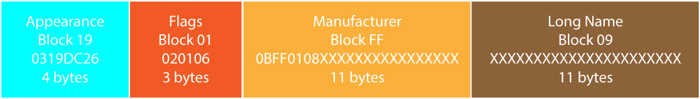

# Defcon Badge Bluetooth Protocol

So you might have noticed that multiple badges talked to each other this year.  How did we do that?  Well, the magic is in the BLE advertising packet.

This packet can be up to 31 bytes long, and consists of a series of 'blocks'.  Each block starts with a byte that indicates how many bytes follow in this block, next byte is the block type, then the rest of the bytes are the block content.

The key parts of the Defcon Badge protocol before it are the Appearance value, according the table below, and the manufacturer block, which defines which badge this is.  The rest of the packet can be whatever you want it to be.

Badge year (appearance value)
 - Defcon 25 - 0xDC19
 - Defcon 26 - 0xDC26
 - Defcon 27 - 0xDC27
 - Defcon 28 - 0xDC28

Here's a visual of a packet that my DC801 badge broadcasted:

Let's break this down:

General notes:  This is the order the DC801 badge sent the blocks, but in reality the order doesn't matter.

First off, Appearance. 4 total bytes, but the length byte doesn't count, so 03 bytes long.  Type is 0x19 to indicate this is a BLE Appearance block, then the Appearance ID of DC26.  If it was a DC25 badge, the ID would be DC19 - yeah, we changed it up a little

Next up, Flags.  The Flags mark what kind of advertisement this is.  With our flags of 06 we indicate we are general connectable and that we'll show up in bluetooth scans.  Open your phone and look for nearby devices - your DC801 badge will show up there.  We don't offer any actual services, so connecting to the badge is a bit of a honeypit to slow down people attempting to figure out the game protocol.

Next block, Manufacturer.  This block is a little special.  The first two bytes is the manufacturer ID, which is byte swapped 'on the wire' as it were: 0108 is 0801.  Some groups actually registered with the BLE group and got a real ID - check out Bender or Queercon.  We didn't get the paperwork done in time, so we used a fake ID that was not in use for 0801.  Now, there are some bytes that follow.  Those bytes can be any length (up to the 31 total, remember), and can mean anything you want them to mean.  In our case for Defcon 25:

0108 - DC801 is the manufacturer
8 bytes - which contains your score, your clan, and a checksum of your score with some bytes scrambled:
 - 0: Command to DCFurs badges - 0x35 indicates rabies infection
 - 1: Score byte 0
 - 2: Score byte 3
 - 3: CRC high byte
 - 4: Score byte 2
 - 5: CRC low byte
 - 6: Score byte 1
 - 7: Clan ID
 
The score can be as big as 32 bytes, unsigned.  I put it through a 'custom' CRC seeded with the polynum 0x0801 to verify that the score hasn't been tampered with - but I know someone is gonna figure that out, but I'm slowing you down a little.  Same for swapping up the bytes of the score.
 

However, bytes 1-6 are different if the badge is a 'god mode' badge sending a command - see [godmode.c](godmode.c) for more specific info, but we support these commands:

 - Sheep mode - user badge gets stuck in a loop showing sheep pictures
 - Party mode - user badge gets stuck showing an animated sheep and some LEDs
 - Score points - send the user badge some points, + or -
 - Score modifier - send the user a score percentage modifier
 - Beep - make the user badge beep

Last block is a type 09, which is the Long Name.  This part of the BLE stack will show up as the name if you scan for a device.  Again, it's 8 chars, always, padded with 00 if shorter.  Other badges didn't even look at this, it was just for showing up in bluetooth scans.  68616d7374657200 is ASCII 'hamster'.

How did you like it?  Let me know!  [@hamster](http://twitter.com/hamster)

